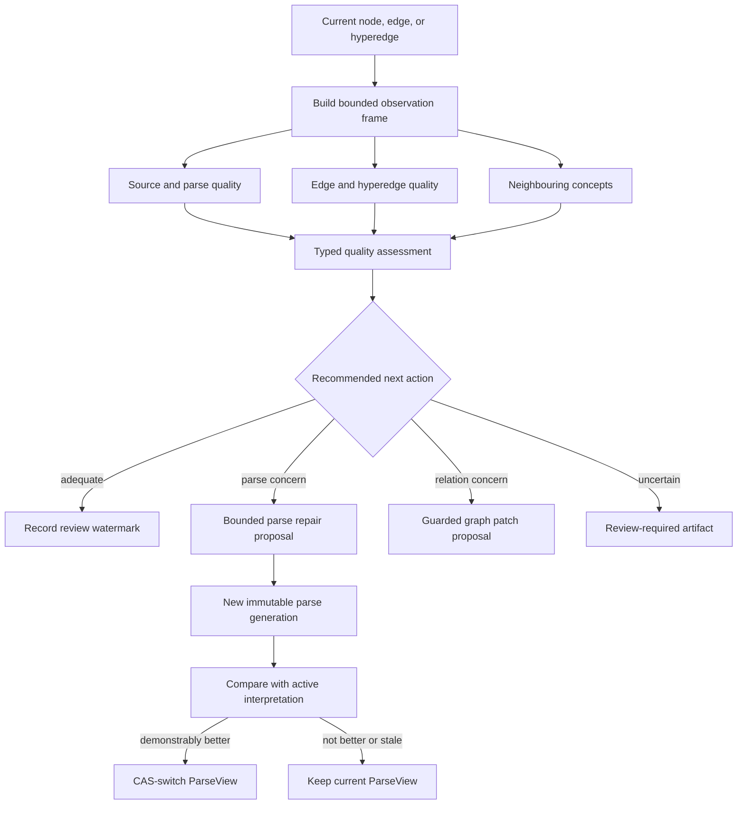
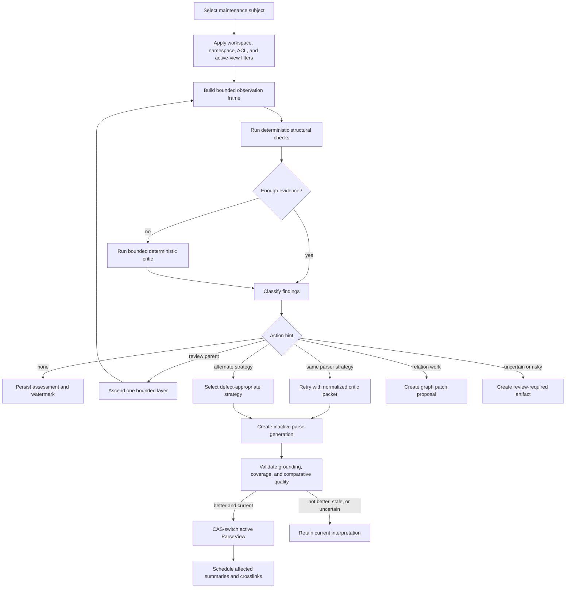

# ADR: Bounded Maintenance Observation And Parse Quality



## Status

Implemented first bounded observation and fail-closed parse-review slice. The
checked items below are covered by executable code and tests in this repository
and the vendored parser. Remaining unchecked items are intentionally not claimed
until their durable lifecycle and backend-specific fences are implemented.

## Context

Background maintenance already selects connected, semantically similar, and
evidence-related candidates. Durable parsing already provides immutable source
revisions, parse generations, bounded frontiers, and per-source ParseViews.
These capabilities are not yet joined by a parse-quality policy.

A maintenance worker may encounter a concept that was derived directly from a
source parse. That concept is useful evidence about where to look, but it is too
narrow to be the review unit. Its quality depends on the source region, its
parent parse layer, its sibling divisions, its incident relations, and nearby
concepts. Conversely, a relation that appears weak may expose a bad parse
boundary rather than a crosslinking problem.

The worker therefore needs one bounded observation step that can form an
opinion about the current subject and recommend what to inspect or repair next.
The recommendation is auditable evidence, not permission to mutate the graph.

## Decision

Introduce an application-level maintenance action named
`review_maintenance_subject`. It accepts a node, ordinary edge, or hyperedge
reference and builds one `MaintenanceObservationFrame` under the existing
workspace, ACL, time, token, call, cost, step, and round budgets.

The frame evaluates three lenses together:

1. **Source interpretation quality**: whether the active parsed evidence is
   grounded, complete, appropriately granular, and consistent with its parent
   and siblings.
2. **Relation quality**: whether incident edges and hyperedges have valid
   endpoints, roles, provenance, scope, status, and evidential support.
3. **Concept neighbourhood quality**: whether a bounded set of nearby concepts
   reveals duplicates, missing distinctions, contradictions, weak labels,
   missing relations, or an unsuitable parse boundary.

The assessment may recommend a next action, but it may not execute that action
inside the review step. Parse repairs, graph patches, and human review remain
separate durable operations with their existing validation and acceptance
fences.

This decision changes maintenance selection, observation, and action routing.
It does not add or alter the persisted Kogwistar node, edge, or hyperedge
models. Existing graph entities remain readable without migration. New review
state is stored as application maintenance/projection metadata and refers to
existing graph entities by stable identity. A reparse still writes a new
immutable generation through the existing derivation path; a relation repair
still uses the existing graph-patch path.

## Observation Frame

```text
MaintenanceObservationFrame
  subject
    kind: node | edge | hyperedge
    id and revision/event identity
    workspace, namespace, ACL scope
  active_source_interpretation
    immutable source revision and digest
    active ParseView id and version
    parse generation/member and exact region
    current node plus immediate siblings and parent
    bounded ancestor path
    parser profile, strategy, diagnostics, and fingerprints
  incident_relations
    bounded edges and hyperedges
    endpoint roles, status, provenance, and grounding
  concept_neighbourhood
    ranked one-hop concepts
    optional second-hop concepts while budget remains
    selection reason and score for every included concept
  prior_assessments
    latest compatible watermark and unresolved findings
```

The subject is only the entry point. If it belongs to parsed source evidence,
the worker resolves it through the active ParseView before review. Historical,
inactive, stale-revision, cross-workspace, or unauthorized artifacts are not
eligible repair targets.

### Parent And Layer Navigation

The first frame includes the immediate parse parent and siblings. The evaluator
may recommend `review_parent` when the concern appears to come from a wider
layer. A continuation may ascend one additional parent level per round, up to a
configured hop limit. It carries a compressed summary and stable IDs instead
of replaying the full prior prompt.

Durable member ancestry uses `ParseGenerationMember.parent_member_id`.
Node-level ancestry uses the active source graph's structural edges. Both must
agree when both are present; disagreement is a parse-quality finding. The
durable worker must persist the frontier item's parent member when committing a
new generation member.

### Bounded Concept Neighbourhood

Neighbour inclusion is deterministic and auditable:

1. direct structural or semantic neighbours;
2. entities sharing authoritative evidence;
3. profile-compatible semantic neighbours;
4. history-related candidates when relevant to the current maintenance lane.

The builder starts at one hop. It may add a second hop only while the remaining
budget can preserve the subject, source grounding, parent/sibling context, and
relation endpoints. It caps high-degree relations per relation type and records
every omission count. Similarity is never compared across embedding-profile
fingerprints.

The default input-budget allocation is a policy, not a storage contract:

| Portion | Default | Purpose |
| --- | ---: | --- |
| Subject and immutable provenance | 20% | Identity and invariant checks |
| Source region, parent, and siblings | 35% | Parse-quality review |
| Incident edges and hyperedges | 20% | Relation-quality review |
| Neighbouring concepts | 20% | Local semantic context |
| Instruction and serialization reserve | 5% | Stable structured request |

Unused capacity may flow to the next section. IDs, revision fences, ACL scope,
and exact source coordinates are never truncated. Excerpts and summaries are
trimmed first. The output budget remains separate.

## Quality Assessment

The worker persists a typed `ParseAndGraphQualityAssessment` in maintenance
state. It contains bounded explanations and evidence references, not hidden
chain-of-thought.

```text
verdict
  adequate | too_coarse | too_fine | coverage_gap | overlap | duplicate
  misgrouped | weak_label | ungrounded | relation_unsupported
  relation_misplaced | contradictory | quality_unknown | review_required

recommended_action
  none | review_parent | expand_children | retry_same_strategy
  switch_to_excerpt | switch_to_boundary | reparse_region
  propose_relation_patch | validate_crosslinks | request_human_review
```

Each finding records:

- the affected node, edge, hyperedge, member, and source-region IDs;
- the deterministic checks and bounded critic evidence that support it;
- confidence and severity;
- the suggested parser strategy or graph action;
- the active ParseView and graph revisions used by the assessment;
- evaluator, prompt, and model versions;
- whether the result is automatic, advisory, or review-required.

An assessment can hint at the next useful direction without conflating review
with mutation. For example, a concept with good grounding but sentence-sized
siblings may recommend reviewing its parent for excessive fragmentation. A
weak crosslink whose endpoints arise from overlapping parse children may
recommend reparsing the parent before attempting link repair.

## Evaluation And Repair Flow



### Defect-Aware Parser Policy

| Finding | First action | Escalation |
| --- | --- | --- |
| Missing or invalid excerpt | Retry excerpt mode with exact failure ranges | Boundary mode |
| Repeated excerpt ambiguity | Boundary mode with authoritative cutpoints | Review-required |
| Coverage gap | Retry the same strategy with uncovered ranges | Alternate strategy |
| Overlap or duplicate children | Retry with conflicting child IDs | Reparse parent |
| Too coarse | Expand the selected region | Semantic-child reparse |
| Too fine | Review and reparse the parent with a coarsening objective | Keep old view if inconclusive |
| Weak label with valid grounding | Retry semantic labeling over unchanged spans | Advisory review |
| Unsupported relation | Validate source and both endpoints | Guarded relation patch proposal |
| Critic unavailable | Record `quality_unknown` | Never report success |

The normalized critic packet is supplied to a same-strategy retry and includes
the previous strategy, child spans, uncovered ranges, conflicts, verdict, and
required corrections. A retry that does not receive this feedback is not a
critic-guided retry.

## Trigger Policy

Random or interest-weighted wandering is an opportunistic trigger, not the
quality guarantee. Reviews may also be triggered by:

- deterministic checks immediately after a generation is completed;
- first encounter with an unreviewed active parse member;
- parser fallback, fuzzy repair, unresolved boundary, or exhausted retry
  diagnostics;
- crosslink validation that exposes weak or contradictory grounding;
- repeated retrieval of a low-value or rejected node;
- an explicit operator or user review request;
- a targeted parser/model/prompt upgrade policy.

A quality watermark is keyed by source revision, ParseView identity and
version, member ID, evaluator version, and critic configuration. An unchanged
interpretation is not repeatedly reviewed until the watermark expires or new
evidence provides a concrete reason.

## Activation And Safety

- Existing persisted nodes, edges, hyperedges, source revisions, generations,
  and ParseViews require no migration or rewriting.
- Raw source documents, source revisions, source-map seeds, spans, user
  statements, and historical parse generations remain immutable.
- Deterministic structural checks are mandatory before ParseView activation.
- Semantic review may run after initial activation, but a proposed replacement
  remains inactive until it is complete and demonstrably better.
- A repair job pins source revision, ParseView version, member, region, and
  semantic fingerprint. Any changed fence makes the proposal stale.
- ParseView replacement uses the existing per-source CAS pointer.
- Relation repair uses the existing typed patch, provenance, and acceptance
  fences; parse review never writes a crosslink directly.
- Maintenance review inherits the originating workspace, namespace, ACL, and
  cumulative budgets.
- A review continuation reuses the same maintenance lineage and cannot call the
  user-facing request path or recursively create a maintenance thread.
- One assessment schedules at most one repair continuation. Further work is a
  later bounded round.
- Provider or critic failure produces `quality_unknown`, not `adequate`.
- Keeping the current interpretation is a normal successful outcome.

## Persistence And Observability

Persist:

- the observation-frame identity and bounded subject/member IDs;
- selection reasons and neighbourhood scores;
- token allocation, truncation, and omitted counts;
- deterministic findings and critic result;
- action recommendation and scheduling decision;
- parser strategy, retry feedback, and strategy switches;
- old and proposed generation/view identities;
- activation, stale, retained, review-required, or failure outcome;
- cumulative time, calls, tokens, cost, steps, and rounds.

OpenTelemetry spans should link observation, critic, repair, comparison, and
activation under one maintenance run without recording raw source text.

## Required Implementation Semantics

The following are completion gates for this ADR. The type names and intent
values alone are not sufficient; each item must be reachable from a real
maintenance job and covered by an executable test.

### Observation Must Be A Real Job

`review_maintenance_subject` must be implemented as a durable maintenance
operation, not only documented as a possible action. It must accept a node,
ordinary edge, or hyperedge, resolve the active ParseView when applicable,
construct the bounded three-lens frame, persist the typed assessment and
watermark, and enqueue at most one bounded continuation. The observation step
itself must never apply a graph patch or create a user-facing maintenance
request.

### Parse Review Must Fail Closed

Parser/provider/critic failure, missing evidence, stale fences, or an
incomplete frontier must produce `quality_unknown` or `review_required`. They
must never be converted into `adequate`, `coverage_ok=True`, or successful
ParseView activation. A same-strategy retry is valid only when the normalized
critic packet is included in the next proposal context.

Every committed `ParseGenerationMember` must retain the consumed frontier
item's `parent_member_id`, parser diagnostics, strategy, retry count, and
critic outcome. This is required for restart-safe parent review and for
distinguishing a child repair from an unrelated new parse.

### Cross-Link Lifecycle Must Be Executable

Cross-link maintenance follows this state machine:

```text
candidate -> validated -> accepted
     |          |           |
     |          |           +--> stale / needs_revalidation
     |          +--------------> rejected
     +-------------------------> review_required

accepted + changed evidence
    -> replacement candidate
    -> validate replacement
    -> add replacement and tombstone old derived edge atomically
```

`document_propose_crosslinks`, `document_validate_crosslinks`, and
`document_retract_crosslinks` must execute real proposal, validation, and
retraction logic. A workflow that only completes a `noop` node is not an
implementation of the lifecycle.

Background proposal generation uses a bounded provider contract that can cite
only host-issued evidence IDs. The host resolves each citation to an immutable
source revision, verifies the exact excerpt with Kogwistar's source-pointer
validator, and applies the ordinary workspace/namespace/ACL/ParseView gates.
Each group receives independent deterministic validation and a separate
structured critic verdict. Automatic routing requires both deterministic
success and critic approval; human routing persists a group evaluation in the
workspace conversation background graph and continues exploration without
waiting for a decision. Provider calls debit the existing maintenance budget
ledger before invocation and append durable usage events, including for
provider failures; retries therefore cannot evade the call limit. A hard
per-job ceiling of thirteen calls bounds one proposal plus up to twelve group
critic reviews. If the critic budget is exhausted, the group is routed to
human review and cannot be auto-accepted. The interactive workbench proposal
flow remains a separate, explicitly user-confirmed capability.

Cross-link updates are never in-place edits. They use a new derived edge plus
a tombstone of the old derived edge, with `supersedes_ids`, provenance, reason,
expected revisions, and the existing acceptance fence. Retraction may target
only derived cross-links. Source-native edges, source-map relationships, raw
source evidence, and historical statements are never retracted by maintenance.

When a ParseView changes, only affected derived cross-links are marked stale
and requeued for validation. Unaffected links remain active. A link whose
grounding is now uncertain is retained as labeled stale evidence until the
guarded retraction or replacement decision is accepted; it is never silently
redirected to an unrelated entity.

Cross-link proposal and acceptance are blocked when any required source region
is `expanding`, `quality_unknown`, `review_required`, stale, unauthorized, or
outside the active ParseView. High similarity alone is never sufficient to
create an accepted semantic relation.

### Scope, Profile, And Recursion Fences

Active-ParseView resolution, workspace/namespace/ACL filtering, source
revision checks, and embedding-profile checks happen before ranking, prompting,
or semantic comparison. Observation and cross-link jobs inherit the original
request's cumulative budgets and round counters. They use the maintenance
lineage directly and cannot recursively invoke the user-facing maintenance
request path or create another maintenance thread.

## Repository Responsibilities

| Repository | Responsibility |
| --- | --- |
| `kogwistar` | Existing graph traversal, job, CAS, event, provenance, ACL, and budget primitives; no parser-specific API |
| `kg-doc-parser` | Structured critic feedback, same-strategy retry context, defect-aware strategy switching, and fail-closed review behavior |
| `kogwistar-llm-wiki` | Active-view-aware selection, observation frames, neighbourhood budgeting, assessment artifacts, ancestry traversal, scheduling, comparison, activation, and invalidation |

No repository should introduce a replacement node, edge, or hyperedge model for
this feature. If an implementation appears to require one, the design must be
reviewed again before changing a core persistence contract.

## Action Checklist

### Parser Contract

- [x] Persist normalized parser diagnostics, strategy, retry count, and critic
  outcome with each generation member.
- [x] Feed normalized deterministic critic findings into the next same-strategy
  proposal.
- [x] Add an optional provider-backed semantic critic behind the same bounded
  structured-result contract; provider failure must remain `quality_unknown`.
- [x] Make critic or provider failure produce `quality_unknown` rather than a
  successful review.
- [x] Classify retry failures so the parser switches strategy only when the
  defect justifies it.
- [x] Preserve the existing bounded, serializable parser interface.

### Durable Parse Lineage

- [x] Copy the consumed frontier item's `parent_member_id` into every committed
  `ParseGenerationMember`.
- [x] Verify member ancestry against immutable source-revision structure before
  ParseView activation; optional source-graph parent assertions remain guarded.
- [x] Store assessment and repair references without changing the Kogwistar
  node, edge, or hyperedge models.
- [x] Keep generation members immutable and ParseView activation CAS-protected.

### Maintenance Observation

- [x] Add active-ParseView filtering before parsed source candidates become
  maintenance subjects.
- [x] Implement `review_maintenance_subject` as a durable executable job for
  nodes, ordinary edges, and hyperedges; do not leave it as a documentation-only
  intent.
- [x] Build the bounded three-lens observation frame for nodes, edges, and
  hyperedges.
- [x] Apply workspace, namespace, ACL, source-revision, and embedding-profile
  filters before neighbourhood ranking.
- [x] Add deterministic coverage, overlap, duplicate, grounding, endpoint,
  provenance, and role checks.
- [x] Persist typed assessments, action hints, selection reasons, truncation
  counts, and quality watermarks.
- [x] Support one bounded parent ascent per continuation round.
- [x] Cap high-degree relation expansion and optional second-hop concepts by
  token budget.
- [x] Persist a quality watermark keyed by source revision, ParseView,
  member, evaluator, and critic configuration.

### Repair Routing

- [x] Route `retry_same_strategy`, `switch_to_excerpt`,
  `switch_to_boundary`, and `reparse_region` through durable parse jobs.
- [x] Route relation findings through existing graph-patch proposal and
  acceptance fences.
- [x] Generate bounded provider-backed background cross-link groups with
  host-resolved, exact source evidence and per-group critic review.
- [x] Persist pending groups as conversation evaluation artifacts; expose
  pending-list and independent, version-checked batch decisions.
- [x] Continue exploration while human decisions are pending and revalidate
  source revisions before applying approved groups.
- [x] Replace the graph-patch `noop` workflow with executable proposal,
  validation, acceptance, and retraction handlers.
- [x] Implement the cross-link lifecycle: candidate, validated, accepted,
  stale/revalidation, rejected, replacement, and retracted. Revalidation keeps
  the old edge untouched until a guarded replacement is accepted.
- [x] Distinguish source-native edges from derived cross-links and reject
  maintenance retraction of source-native edges.
- [x] Rebuild links using add-replacement plus tombstone-old-edge semantics;
  never mutate an accepted edge in place.
- [x] Requeue only affected derived links after a ParseView switch and retain
  stale links as labeled evidence until a guarded decision is accepted.
- [x] Block cross-link acceptance when parse quality is uncertain, the source
  region is inactive/stale, or scope/profile/ACL checks fail.
- [x] Schedule at most one repair continuation from one assessment.
- [x] Compare the proposed generation with the active interpretation before
  activation.
- [x] Reject stale repairs if the source revision, ParseView version, member,
  or semantic fingerprint changed.
- [x] Invalidate only affected summaries, crosslinks, and projections after a
  successful ParseView switch.

### Observability And Operations

- [x] Add traces linking observation, critic, repair, comparison, and
  activation under one maintenance run.
- [x] Expose assessment status, watermark, ancestry depth, budget use, action
  hint, and final outcome without exposing raw source text.
- [x] Add bounded per-job knobs for observation probability, ancestor hops,
  neighbourhood count, token allocation, and watermark expiry.
- [x] Keep request and background maintenance switches independent.
- [x] Record whether every recommendation was observation-only, parse repair,
  cross-link proposal, cross-link replacement, retraction, or review-required.

## Validation Checklist

- [x] Historical or inactive parse nodes cannot trigger a repair.
- [x] Existing persisted graph fixtures load unchanged and require no backfill.
- [x] Existing node, edge, and hyperedge serialization remains byte-compatible.
- [x] Cross-workspace, cross-namespace, or unauthorized neighbours are excluded
  before scoring or prompt construction.
- [x] Parent/sibling ancestry is stable across retries and worker restarts.
- [x] Every committed generation member preserves `parent_member_id`, parser
  diagnostics, strategy, retry count, and critic outcome.
- [x] Same-strategy retries contain the prior normalized critic findings.
- [x] Critic failure records `quality_unknown` and does not activate a
  replacement.
- [x] Too-coarse and too-fine fixtures choose different bounded actions.
- [x] Relation defects can recommend parse review before crosslink repair.
- [x] Cross-link proposal workflows produce real candidates rather than a
  successful no-op workflow.
- [x] Candidate, acceptance, stale/revalidation, replacement, rejection, and
  retraction transitions are idempotent and auditable.
- [x] Source-native edges cannot be retracted by cross-link maintenance.
- [x] A ParseView switch requeues only affected derived links, summaries, and
  projection refreshes.
- [x] Cross-link acceptance is blocked for uncertain parsing and unauthorized,
  inactive, stale, or profile-incompatible evidence.
- [x] A node, edge, and hyperedge can each serve as an observation subject.
- [x] High-degree neighbourhoods remain deterministic and within token limits.
- [x] Same-dimension but different embedding profiles are never compared.
- [x] Duplicate delivery creates one assessment and at most one continuation.
- [x] A concurrent ParseView change makes the repair stale without changing
  active interpretation.
- [x] Raw source and historical generations remain byte-for-byte unchanged.
- [x] Existing parse-first, maintenance-first, hybrid, and explicit targeted
  reparse behavior remains compatible.
- [x] Observation and repair continuations preserve request budgets, round
  counters, and non-recursive maintenance lineage.
- [x] CPython, PyPy, backend, ACL, namespace, crash-recovery, and durable queue
  suites remain green.

Validation evidence for this slice: the configured CPython CI marker suite passed
`827 passed, 7 skipped, 129 deselected`; the same marker suite passed under the
official Linux PyPy 3.11 image with the same counts; the full unit suite passed
`805 passed, 6 skipped`; and the memory, Chroma, and live pgvector profile
isolation smoke passed. The live pgvector check provisions `vector` before
creating profile-scoped tables and verifies two incompatible dimensions remain
isolated.

## Provider-Backed Background Cross-Link Group Status

The implementation now has the following guarded behavior:

- [x] Cross-link evidence is host-selected and requires an exact character
  span and excerpt match against the current immutable source revision.
- [x] Invalid provider groups are rejected independently and do not prevent
  valid groups from continuing through critic review.
- [x] Rejected groups, pending reviews, stage traces, and terminal run
  summaries are persisted in the background maintenance conversation lane,
  separate from foreground user conversation records.
- [x] Cross-link runs carry a stable workspace, request, job, worker, attempt,
  workflow-version, and maintenance-run identity.
- [x] Conflicting cross-link graph resources use durable named-projection CAS
  leases at apply time; a conflicting job is requeued rather than applied.
- [ ] A live two-worker execution has not yet been run against the production
  PostgreSQL setup; the durable queue and lock paths still require that gate.
- [ ] The bounded Bonsai 2 evaluation remains blocked until the model endpoint
  is confirmed available and a live run satisfies the existing parse-quality
  and cross-link-quality cutoff.

These implementation checks do not claim that a live provider run has created
valid semantic links. Live evidence must still include provider calls, exact
source grounding, critic decisions, durable traces and summaries, and any
resulting graph mutations.

## Explicit Non-Goals

- No replacement Kogwistar node, edge, or hyperedge model.
- No destructive migration or backfill of existing graph data.
- No mutation of raw source, source revisions, or historical parse evidence.
- No unbounded graph walk or prompt context.
- No automatic semantic truth derived from similarity alone.
- No parser-specific API in Kogwistar core.
- No repair activation merely because a new parse is different.

## Consequences

The maintenance worker gains a coherent way to improve parsing, relations, and
local graph structure from the same bounded context. It can follow useful hints
up the parse hierarchy without pretending that every nearby concept is equally
relevant. The cost is an additional assessment artifact, ancestry metadata,
and comparison policy, but these make the behavior observable and prevent
random maintenance from becoming uncontrolled reparsing.
