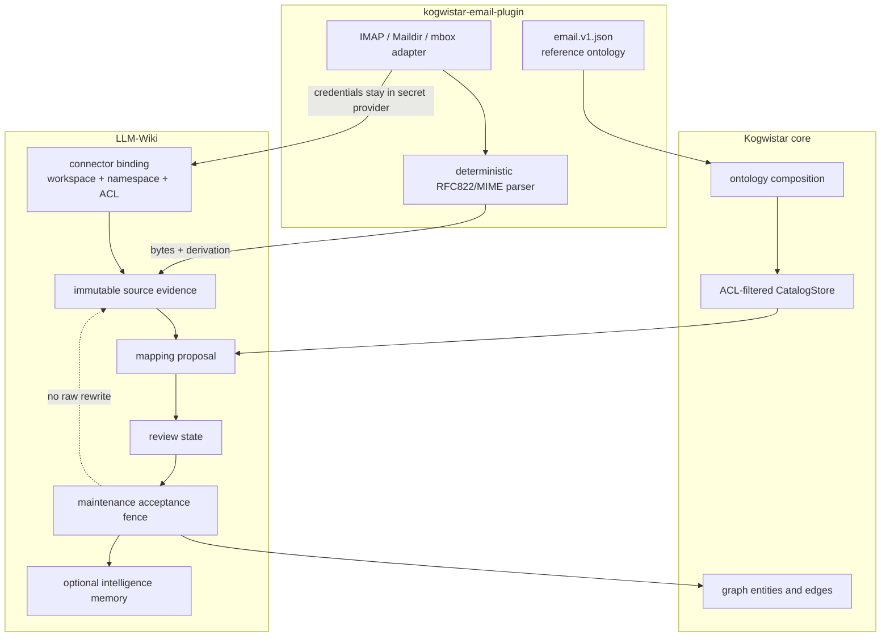
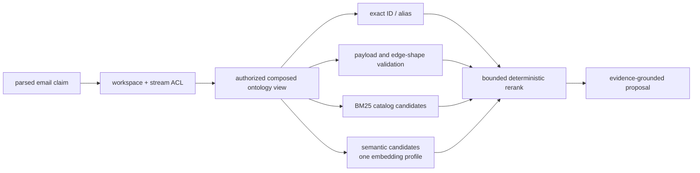

# ADR: Composable Ontology Plugins And Email Intelligence

## Status

Accepted for staged implementation. The current LLM-Wiki branch contains the
bounded parser/evidence/viewer/review slices; connector registry, semantic
ontology search, and intelligence-memory promotion remain gated follow-up
work. This ADR does not authorize a release by itself.

## Context

LLM-Wiki needs to ingest event streams whose payloads have domain meaning. An
email stream is the first concrete example: messages contain participants,
threads, attachments, invitations, requests, commitments, and other facts that
are more useful when mapped to explicit domain classes and relations.

The solution must support more than one ontology at a time. A deployment may
combine a generic communication ontology, an email ontology, an organization
ontology, and a project-specific vocabulary. Those packages must remain
searchable and independently versioned without making ontology descriptions
canonical truth about an individual message.

The existing repositories already provide most of the required substrate:

- Kogwistar has stable graph identities, multi-endpoint edges, logical
  references, ACL derivation, an ACL-aware catalog, lexical and semantic
  catalog ranking, named projections, BM25 search indexing, and event history.
- KG Doc Parser owns reusable document parsing, but is not an email transport or
  mailbox synchronization service.
- LLM-Wiki owns source revisions, application namespaces, proposal and
  acceptance policy, maintenance, and intelligence memory.

An ontology must not become a parallel graph engine, an authorization system,
or an excuse to mutate raw source evidence.

## Decision

Introduce a generic, declarative ontology package contract in Kogwistar only
where the existing catalog descriptor is insufficient. Implement email source
access, RFC822/MIME parsing, and the reference email ontology in a separately
installable plugin repository. Keep stream binding, ontology selection,
candidate mapping, acceptance, and intelligence-memory policy in LLM-Wiki.

The high-level flow is:

```text
mail provider / Maildir / mbox
  -> authorized connector binding
  -> immutable mailbox event and raw RFC822 source revision
  -> deterministic email parse derivation
  -> ACL-filtered ontology discovery
  -> ontology mapping proposal
  -> validation and acceptance fence
  -> curated graph facts and intelligence memories
```

Ontology packages describe permissible vocabulary and shapes. They do not
execute tools, grant access, choose a workspace, accept inferred facts, or
rewrite source evidence.

### Architecture And Trust Boundaries



The plugin supplies data and declarative vocabulary, core supplies reusable
composition/catalog/graph mechanics, and LLM-Wiki supplies authorization,
review, and product policy. No arrow from an email header grants access.

## Repository Ownership

### Kogwistar Core

Kogwistar owns only reusable contracts and mechanics:

- immutable ontology package, term, property, relation, and shape descriptors;
- deterministic package identity, dependency resolution, composition, and
  conflict diagnostics;
- descriptor registration through the existing ACL-aware catalog;
- graph references to ontology descriptors;
- validation of a proposed payload or multi-endpoint edge against a selected
  composed ontology view;
- backend-neutral lexical, graph, and optional semantic discovery surfaces.

Kogwistar does not own email classes, MIME parsing, mailbox credentials,
connector scheduling, ontology-to-prompt policy, acceptance thresholds, or
memory promotion.

The existing `CatalogEntry`, `CatalogStore`, `LogicalRef`, graph entities,
multi-endpoint edge model, `NamedProjectionStore`, and search-index contracts
must be reused. A new ontology registry must not duplicate them.

### Email Ontology Plugin

A new repository, provisionally `kogwistar-email-plugin`, owns:

- IMAP, Maildir, mbox, and individual RFC822 source adapters;
- provider cursor models such as IMAP UIDVALIDITY and UID;
- deterministic MIME parsing and attachment manifests;
- the versioned email ontology package and mapping rules;
- synthetic RFC822 fixtures and optional corpus import tooling;
- a GreenMail development/test profile and deterministic seed utility.

The plugin should expose small Python entry points rather than requiring an
LLM-Wiki fork. Packaging extras may separate transport dependencies from the
dependency-light ontology and parser contracts:

```text
kogwistar-email-plugin
kogwistar-email-plugin[imap]
kogwistar-email-plugin[greenmail-test]
```

No mail-server dependency belongs in Kogwistar core.

### LLM-Wiki

LLM-Wiki owns:

- installation and enablement of ontology plugins;
- connector-to-workspace, namespace, principal, and ACL binding;
- durable synchronization jobs, retries, cursors, and budgets;
- immutable source revisions and active parse views;
- ontology selection and composition policy per workspace or source binding;
- candidate mapping, provenance, confidence, review, and acceptance;
- dependency invalidation after an accepted mapping changes;
- derived intelligence memories and maintenance policy;
- operator status, metrics, traces, and audit views.

KG Doc Parser requires no email-specific behavior. It may consume generic text
or attachment documents emitted by the plugin, but the email envelope and MIME
tree remain plugin-owned derivations.

## Ontology Package Contract

### Package Identity

An immutable package is identified by:

```text
ontology_id + semantic_version + content_sha256
```

The package declares:

- schema version;
- provider ID and provider version;
- human-readable name, summary, aliases, and tags;
- tenant/project scope, when not global;
- dependencies with version ranges and optional pinned content digests;
- exported namespace aliases;
- class, property, relation, and edge-shape descriptors;
- optional mapping-rule descriptors;
- superseded package identities, without destructive replacement.

Descriptors use stable logical IDs within the ontology namespace. A descriptor
revision changes content but does not silently change the identity of already
accepted graph entities.

### Term And Shape Descriptors

The minimal descriptor kinds are:

- `ontology_class`: a payload/entity class and its allowed properties;
- `ontology_property`: a typed field, cardinality, aliases, and constraints;
- `ontology_relation`: relation semantics and allowed endpoint classes;
- `ontology_edge_shape`: named endpoint roles and cardinalities for a
  multi-endpoint edge;
- `ontology_mapping_rule`: a declarative, bounded candidate rule;
- `ontology_profile`: a named composition or domain entry point.

Descriptors are data. They may name a validator or mapper capability supplied
by a trusted plugin, but must not contain arbitrary executable code.

Kogwistar's existing edge representation remains authoritative. An ontology
edge shape declares roles and cardinalities; it does not create a second
hyperedge implementation. When endpoint roles are needed, they are represented
in deterministic edge metadata or a validated role binding associated with the
existing source/target node and edge IDs.

### Composition

Composition produces an immutable, rebuildable `ComposedOntologyView` for one
authorized scope. It is not a mutation of any source package.

Composition rules are deterministic:

1. Resolve dependencies by package identity and declared version constraints.
2. Verify package content digests before reading descriptors.
3. Apply explicit namespace aliases; never infer aliases from display names.
4. Merge identical logical descriptors only when fingerprints match.
5. Require an explicit override declaration for a compatible extension.
6. Reject incompatible property types, cardinalities, endpoint roles, or
   namespace collisions.
7. Fail closed on missing dependencies, cycles, ambiguity, or conflict.
8. Record the ordered package identities and composition digest.

There is no last-loaded-wins behavior. Installation order must not change the
composed result.

An extension may add optional properties, subclasses, aliases, or narrower
constraints only when compatibility rules allow it. It may not weaken another
package's ACL, provenance, evidence, or required-property constraints.

## Email Stream And Identity Model

### ACL Stream Boundary

An email address is not an ACL boundary. Header addresses are claims in a
message and may be spoofed, malformed, aliased, or shared.

The authorized stream is a connector binding:

```text
tenant_id
  + workspace_id
  + connector_id
  + account_principal_id
  + mailbox_id
  + optional folder_id
```

This tuple produces a deterministic `mail_stream_id` and namespace. Each
binding has an explicit owner, readers, service principal, and credential
reference. Credentials are held by a secret provider and never written to a
graph, ontology package, source revision, log, trace, or job payload.

Addresses such as sender, `To`, `Cc`, and `Bcc` are participants inside the
stream. Cross-stream linking is allowed only after both sides pass workspace,
namespace, and principal authorization. BCC membership remains restricted and
must not leak through catalog search, graph traversal, or derived memory.

A deployment may expose a verified account-bound address as a logical
substream, but the substream inherits authority from its connector binding. An
address observed only in an RFC822 header can never create or select an ACL
stream.

### Mailbox Events And Message Evidence

Mailbox synchronization produces immutable event records such as:

- `message_discovered`;
- `message_revision_observed`;
- `flags_changed`;
- `message_moved`;
- `message_deleted` or `message_tombstoned`;
- `cursor_advanced`.

Provider identity uses account, mailbox/folder, UIDVALIDITY, and UID where
available. `Message-ID` is indexed as a useful claim but is not trusted as a
globally unique or authentic identifier.

The raw RFC822 bytes are stored as an immutable source revision keyed by a
content digest. Header normalization, body extraction, attachment extraction,
threading, participant resolution, and ontology mapping are derivations. A
parser or maintenance worker may create a corrected interpretation but may not
rewrite the raw message.

## Email Parser Contract

The plugin parser accepts immutable bytes plus a source identity and returns a
versioned, serializable derivation. The first implementation should use
Python's standard `email` package for RFC5322 and MIME parsing and preserve:

- raw header occurrences and normalized decoded values;
- parser defects and undecodable byte diagnostics;
- text/plain and text/html alternatives without remote resource fetching;
- nested multipart structure and `message/rfc822` children;
- attachment metadata, content digest, media type, and immutable blob reference;
- sender, reply-to, recipients, subject, dates, and timezone evidence;
- `Message-ID`, `In-Reply-To`, and ordered `References` claims;
- provider folder, flags, UIDVALIDITY, UID, and synchronization timestamp.

The parser must be deterministic for the same raw bytes and parser profile.
HTML is treated as untrusted content. Rendering and sanitization are separate
bounded steps. Attachment extraction enforces byte, nesting, compression,
media-type, and count limits and never executes active content.

Thread membership is a proposal derived from explicit headers first and
heuristics second. It is not source truth and cannot cross ACL boundaries.

## Reference Email Ontology

The first package should define a deliberately small vocabulary:

### Classes

- `EmailMessage`
- `Mailbox`
- `MailFolder`
- `EmailAddress`
- `Person`
- `Organization`
- `EmailThread`
- `Attachment`
- `CalendarInvitation`
- `DeliveryEvent`
- `ActionItem`
- `Commitment`

### Relations And Edge Shapes

- `message_exchange`: one message, one asserted sender, and zero or more
  `to`, `cc`, and `bcc` recipient roles;
- `thread_membership`: message to proposed thread;
- `reply_to` and `forward_of`: message-to-message derivations;
- `attachment_of`: attachment to message;
- `mentions`: message span to entity candidate;
- `meeting_invitation`: message, organizer, attendees, and calendar artifact;
- `requests_action`: message, requester, assignee candidates, and action item;
- `commits_to`: participant, commitment, affected subject, and due-time claim.

The envelope parser may deterministically propose structural classes and
relations. `ActionItem`, `Commitment`, organization identity, and ambiguous
person resolution require semantic extraction and application acceptance.

## Search And Mapping



Authorization and composed-view selection happen before lexical or semantic
ranking. A similarity score never becomes canonical graph truth by itself.

Ontology descriptors must support three complementary discovery paths:

1. Graph discovery for dependencies, subclasses, allowed properties, and edge
   endpoint shapes.
2. Lexical/BM25 discovery over names, aliases, summaries, examples, and
   property descriptions.
3. Semantic discovery through an embedding-profile-scoped projection.

The existing Kogwistar catalog is the descriptor inventory and ACL filter.
Ontology descriptors become catalog entries with ontology-specific kinds and
metadata. The existing search index may materialize BM25 records. Semantic
vectors remain projections and are isolated by the complete embedding profile
fingerprint.

Candidate mapping follows this order:

```text
authorize packages and descriptors
  -> enforce selected composed view
  -> exact ID / alias / declared mapping rules
  -> payload and endpoint-shape compatibility
  -> BM25 candidates
  -> semantic candidates within one embedding profile
  -> bounded reranking
  -> persist proposal with evidence and scores
```

Scores from different embedding profiles are never compared or combined as if
they share a scale. Semantic similarity can propose a class or relation but can
never create canonical knowledge by itself.

Each proposal records source revision, source spans, composed-view digest,
descriptor IDs and revisions, mapping strategy, lexical and semantic scores,
model/profile identity, plugin version, confidence, and rejection reason.

## Intelligence Memories

Email intelligence memory is a derived, evidence-backed LLM-Wiki artifact. It
may summarize accepted facts such as a durable preference, relationship,
project decision, action item, or commitment. It is not a copy of every message
and is not a substitute for the mailbox event stream.

Memory creation follows existing LLM-Wiki safeguards:

- source evidence and ontology references are pinned;
- ACL is derived from all contributing evidence and never widened;
- cross-stream aggregation requires authorization to every source;
- uncertain or conflicting interpretations remain proposals;
- correction is append-only plus supersession/tombstone semantics;
- maintenance cannot alter raw facts or execution history;
- ontology reclassification does not recursively create maintenance requests;
- package upgrades do not trigger an automatic corpus-wide remap.

An ontology package may declare candidate memory templates, but LLM-Wiki owns
whether a template is enabled, budgeted, accepted, retained, or promoted.

## GreenMail And Dataset Decision

Use GreenMail as the default integration server. It provides SMTP, IMAP, POP3,
and a lightweight API in a standalone Docker image, which is sufficient for
deterministic account creation, message seeding, synchronization, flag, move,
and deletion tests.

Do not bake a public email corpus into a Docker image or Git repository. The
default CI corpus consists of synthetic RFC822 fixtures covering realistic
threads, aliases, malformed MIME, HTML, attachments, invitations, BCC, moves,
deletions, duplicates, and spoofed headers.

Use the CMU Enron corpus only in an optional manual/slow evaluation profile.
It contains roughly half a million real messages from about 150 users and has
privacy, redaction, correction, attachment, and authenticity caveats. A helper
may download a user-supplied corpus, verify a documented checksum, select a
bounded subset, and seed GreenMail. Corpus bytes and extracted personal data
must not become repository fixtures, CI artifacts, images, traces, or logs.

The smaller CMU Enron meetings, random, disambiguation, and threading subsets
are preferable for targeted mapping and graph evaluations because they provide
bounded task-oriented material.

## Security And Privacy Invariants

- Authorization occurs before ontology discovery, mapping, dereferencing,
  graph traversal, memory retrieval, and result ranking.
- A composed ontology view cannot widen tenant, workspace, namespace, or source
  ACLs.
- Sender and recipient headers are assertions, not proof of identity.
- Authentication results such as SPF, DKIM, and DMARC are stored only when
  supplied by a trusted connector and remain provenance-qualified observations.
- Raw RFC822 bytes and attachment blobs are immutable by content digest.
- Remote images, links, scripts, and external MIME resources are never fetched
  during parsing.
- Parser limits protect against MIME recursion, oversized headers, excessive
  parts, decompression bombs, and pathological encodings.
- Secrets and OAuth tokens never enter source, graph, projection, telemetry, or
  ontology payloads.
- Deletion policy distinguishes provider deletion, source tombstone, legal
  retention, and derived-memory invalidation.
- Uninstalling an ontology plugin removes active projections and capabilities,
  not historical evidence or accepted graph events.

## Compatibility And Migration

Ontology support is additive. Existing graph entities and project glossary
providers remain valid. A project glossary can later be represented as a
minimal ontology package, but no destructive migration is required.

Legacy untyped mappings remain readable as historical derivations. New writes
must use a selected composed-view digest and validated descriptor references.
If a package or plugin is unavailable, historical data remains readable while
new mapping fails closed with an operator-visible capability error.

## Observability

Expose, without message content or secrets:

- connector and stream ID, workspace, mailbox, and cursor status;
- discovered, parsed, mapped, accepted, rejected, and failed counts;
- parser and ontology package versions;
- composed-view digest and conflict diagnostics;
- mapping strategy, bounded candidate counts, and latency;
- memory proposals, acceptance outcomes, and invalidation reasons;
- ACL denials and cross-stream-link rejection counts;
- GreenMail/corpus test profile identity.

Traces must use opaque source IDs and digests rather than subjects, addresses,
message bodies, attachment names, or recipient lists by default.

## Rejected Alternatives

### Treat each email address as an ACL stream

Rejected because addresses are untrusted message claims, may be aliases or
shared identities, and do not identify the authorized mailbox being observed.

### Put email classes and MIME parsing in Kogwistar core

Rejected because they are domain and transport concerns. Core should remain
usable without mail dependencies or policy.

### Store ontology only as ordinary graph nodes

Rejected as the sole representation because package identity, composition,
conflict validation, and immutable descriptor revisions need explicit
contracts. Graph and search projections remain valuable derived views.

### Let the LLM choose any ontology term at write time

Rejected because it bypasses package selection, ACL filtering, shape
validation, provenance, and acceptance fences.

### Merge ontology packages in installation order

Rejected because last-loaded-wins is non-deterministic and unsafe.

### Commit or publish the Enron corpus with the test stack

Rejected because of size, privacy, provenance, redaction, and authenticity
concerns. Corpus evaluation remains opt-in and local.

## Consequences

- Domain intelligence becomes pluggable without turning core into a domain
  model repository.
- Ontologies are searchable through existing graph, BM25, and semantic
  infrastructure while retaining ACL and embedding-profile isolation.
- Email ingestion has a realistic container test path without shipping private
  or legally ambiguous data.
- The first delivery spans multiple repositories and must follow dependency
  order, but each milestone remains reviewable and independently testable.

## References

- [GreenMail project and protocol support](https://github.com/greenmail-mail-test/greenmail)
- [GreenMail standalone and Docker deployment](https://greenmail-mail-test.github.io/greenmail/)
- [CMU Enron Email Dataset](https://www.cs.cmu.edu/~enron/)
- [CMU Enron meeting, random, disambiguation, and threading subsets](https://www.cs.cmu.edu/~einat/datasets.html)
- [RFC 5322: Internet Message Format](https://www.rfc-editor.org/rfc/rfc5322)
- [RFC 2045: MIME Part One](https://www.rfc-editor.org/rfc/rfc2045)
