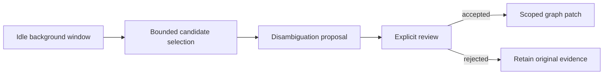

# ADR: Dream Mode Entity Disambiguation



## Status

Proposed

## Context

`kogwistar` core now has dream-loop and wisdom-layer primitives for selecting
signals, creating proposals, evaluating evidence, and writing reusable lessons.
`kogwistar-llm-wiki` also has an app-level maintenance lane with graph patch
proposal and apply workflows.

Entity ambiguity belongs at the `kogwistar-llm-wiki` layer because it depends on
product semantics:

- source documents and parsed mentions
- entity labels, aliases, and local graph neighborhoods
- review policy and user-facing questions
- app-specific repair choices such as canonicalization, aliasing, or
  disambiguation

At the same time, the implementation must not duplicate core Kogwistar
semantics. Core remains responsible for graph lifecycle, provenance,
append-only tombstone behavior, generic dream-loop proposals, and wisdom
artifacts. The app layer should express entity disambiguation as maintenance
artifacts and graph patches built on those primitives.

Pending disambiguation questions are provisional. They are valid only relative
to the evidence available when they were created. New documents, sources,
mentions, aliases, or graph facts can resolve, weaken, supersede, or challenge
them.

## Decision

Add dream-mode entity disambiguation as an app-level maintenance behavior in
`kogwistar-llm-wiki`.

The feature will create and reconcile provisional disambiguation artifacts, then
lower accepted repairs into existing maintenance patch operations:

- `ADD_NODE`
- `ADD_EDGE`
- `TOMBSTONE_NODE`
- `TOMBSTONE_EDGE`
- `REQUEST_REVIEW`
- `NOOP`

It will not add new low-level graph mutation primitives. It will not place
live pending questions in the `wisdom` graph. Wisdom may later store reusable
lessons learned from repeated disambiguation outcomes, but the active queue of
questions and repair candidates remains app maintenance state.

## Ownership Boundary

### Kogwistar Core

Core owns:

- graph spaces and namespace semantics
- append-only writes and tombstone lifecycle
- versioned artifact helpers
- generic dream-loop proposal/evaluation primitives
- wisdom as reusable lessons derived from evidence and outcomes

Core should not know about llm-wiki-specific entity ambiguity statuses, user
questions, alias heuristics, or source-document repair policy.

### Kogwistar LLM-Wiki

LLM-Wiki owns:

- entity ambiguity detection
- mention grounding ambiguity
- candidate scoring
- review question generation
- freshness checks before user surfacing
- disambiguation repair proposals
- policy thresholds for user review vs automatic resolution
- distillation of repeated outcomes into wisdom candidates

## Artifact Family

The app should use a small artifact family:

- `entity_disambiguation_candidate`
- `mention_grounding_ambiguity`
- `disambiguation_review_request`
- `disambiguation_decision`
- `disambiguation_decision_challenge`

These are maintenance artifacts, not durable curated KG truth by themselves.

## Lifecycle Fields

Avoid copying or expanding core dream-loop proposal statuses directly. Use
separate app-level lifecycle fields:

```text
artifact_status:
  pending
  resolved
  superseded
  stale
  insufficient_evidence
  needs_more_evidence_collection
  challenged

resolution_source:
  none
  user
  policy
  new_evidence
  prior_decision

semantic_decision:
  same_entity
  distinct_entities
  ambiguous
  ill_formed_candidate
  insufficient_evidence
```

Projected status names can be derived from these fields:

```text
resolved_by_user = artifact_status:resolved + resolution_source:user
resolved_by_policy = artifact_status:resolved + resolution_source:policy
resolved_by_new_evidence = artifact_status:resolved + resolution_source:new_evidence
decision_challenged = artifact_status:challenged
```

This keeps the app lifecycle expressive without creating a second version of the
core dream-loop status model.

## Evidence Snapshot

Every pending disambiguation artifact should record the evidence scope that made
the question valid:

```text
evidence_snapshot_id
evidence_cutoff_ms
last_reconciled_evidence_version
candidate_key
entity_ids
alias_keys
mention_ids
source_document_ids
source_span_ids
score_bundle
```

The `score_bundle` should keep at least:

```text
merge_likelihood
distinction_pressure
review_priority
usage_frequency
answer_risk
```

## Freshness Rule

Before surfacing a `disambiguation_review_request` to a user, the system must
check that:

- the artifact is still pending
- it has not been superseded
- no newer evidence directly resolves it
- the candidate set is still accurate
- the evidence summary is current
- the question is still concrete and answerable
- `latest_evidence_version == last_reconciled_evidence_version`

If any check fails, the question must not be shown to the user until
reconciliation runs.

## New Evidence Reconciliation

When new documents, sources, mentions, aliases, or graph facts are injected, the
maintenance worker should run a targeted reconciliation pass:

1. Identify affected entities, aliases, mentions, source spans, source
   documents, and candidate keys.
2. Find pending or previous disambiguation artifacts touching those keys.
3. Re-score affected candidates.
4. Decide whether each artifact remains pending, is resolved, is superseded, is
   stale, needs more evidence, or is challenged.
5. Persist a new maintenance artifact/event explaining the transition.
6. Propose graph patch operations only when policy or review allows repair.

The pass should be key-driven. It should not scan every pending ambiguity record
after every ingest unless running an explicit cold maintenance sweep.

## Case Semantics

### New Evidence Proves Equivalence

If new evidence explicitly proves two candidates are the same entity:

- mark the pending artifact as resolved with `resolution_source=new_evidence`
- create a `disambiguation_decision` with cited evidence
- propose canonicalization or alias repair operations
- avoid asking the user the stale question

The durable repair should lower to append-only patch operations, such as adding
an alias/canonicalization edge and tombstoning incorrect duplicate candidate
edges.

### New Evidence Proves Distinction

If new evidence explicitly proves candidates are distinct:

- mark the pending artifact as resolved with `resolution_source=new_evidence`
- create a `disambiguation_decision` with cited evidence
- propose `disambiguates_from` or scoped `not_same_as_under_evidence` relation
- add differentiating traits with source spans when policy allows
- avoid asking the user the stale question

### New Evidence Weakens Ambiguity

If new evidence changes the likelihood but does not resolve the ambiguity:

- write a refreshed candidate artifact
- recompute `merge_likelihood`
- recompute `distinction_pressure`
- recompute `review_priority`
- supersede or stale the old review request if its wording is misleading
- create a new review request only if the updated question is concrete

### New Evidence Makes The Question Ill-Formed

If the old candidate set is wrong, such as two entities becoming three, or one
candidate being a product while another is a company:

- mark the old review request as superseded
- create a new candidate with the corrected group or candidate kind
- preserve the old artifact historically
- do not delete or overwrite the old artifact

### New Evidence Challenges A Previous Decision

If new evidence conflicts with a previous disambiguation decision:

- leave the old decision historically intact
- create a `disambiguation_decision_challenge`
- cite the new conflicting evidence
- mark affected derived repair operations as needing review
- propose tombstone plus replacement operations only after review or policy
  approval

## Prompt Contract

The LLM-facing reviewer should be conservative and evidence-bound.

It should return:

```text
semantic_decision:
  same_entity
  distinct_entities
  ambiguous
  ill_formed_candidate
  insufficient_evidence

confidence
evidence_for_same
evidence_for_distinct
missing_evidence
recommended_artifact_status
recommended_resolution_source
user_question
proposed_patch_intent
```

Prompt rules:

- use only cited evidence
- distinguish similarity from identity
- require hard identifiers for risky human/person merges
- prefer `needs_more_evidence_collection` over vague user questions
- ask the user only when the question is concrete and answerable
- never propose direct in-place mutation

## User Question Policy

Questions should be high signal and specific.

Good:

```text
Are "John Smith, district 7 council member" and "John Smith, school board
candidate" the same person?
Evidence suggesting same: same district and overlapping event mentions.
Evidence suggesting distinct: different occupation and separate source pages.
```

Bad:

```text
Could John mean something else?
```

The system should prioritize questions by:

- user-visible impact
- answer risk
- usage frequency
- high merge likelihood plus meaningful distinction pressure
- availability of a concrete answer choice

## Relationship To Wisdom

Pending disambiguation artifacts do not belong in the wisdom graph.

Wisdom may receive distilled lessons after repeated outcomes, such as:

- company former-name evidence is strong alias evidence
- common human names require hard identifiers before merge
- product/company ambiguity should default to distinct entities unless source
  evidence says otherwise

These lessons may guide later maintenance workers, but they are not live
execution state.

## Consequences

Benefits:

- avoids stale user questions
- preserves append-only audit history
- keeps core and app semantics separate
- reuses existing graph patch validation and application
- allows batch dream mode and on-the-fly answer-time checks to share the same
  artifact model

Costs:

- requires evidence version tracking or equivalent freshness watermarks
- requires candidate-key indexing for efficient reconciliation
- adds a review artifact family that must be projected and queried carefully
- makes user question surfacing dependent on a reconciliation precheck

## Implementation Notes

Initial implementation should add this as maintenance policy and artifact
handling in `kogwistar-llm-wiki`.

Likely job kinds:

- `entity_disambiguation_scan`
- `entity_disambiguation_reconcile`
- `entity_disambiguation_review`
- `entity_disambiguation_patch_proposal`

`entity_disambiguation_scan` is a deterministic direct maintenance operation:
it reads bounded typed observations from explicitly injected channel providers,
checks every requested source stream before reading, proposes candidates, and
persists immutable review snapshots. It does not invoke an LLM workflow and
does not merge entities. Channel adapters enqueue this job after an authorized
source update. The standard maintenance CLI and combined server pass scan
providers registered by explicitly enabled Workbench extensions into the
worker; embedded daemon callers can inject the same generic provider map and
host ACL authorizer. Missing provider or ACL configuration fails closed and
leaves the durable job retryable.
The job's stream IDs identify changed trigger sources, not the complete
comparison scope. A cross-channel provider must authorize each additional
stream before reading it; the worker rechecks authorization for every returned
observation before persisting any candidate.

Reconciliation, review, and patch-proposal jobs may use the existing workflow
and graph-patch paths where appropriate. A user decision remains an explicit
separate operation; candidate discovery alone cannot produce canonical links.

No core schema change is required for the first implementation. Core changes
should be considered only if repeated app behavior reveals a genuinely reusable
primitive.

### Current Scan Bound And Scale-Up Contract

The current automatic maintenance scan is intentionally fail-closed at 250
observations and 500 generated candidates. An oversized result is rejected
before any candidate snapshot is written or the job acknowledged; it is never
truncated into an apparently complete scan. The separately paged contact
directory API may read up to 5,000 observations, but that limit does not apply
to automatic matching. These are distinct capabilities.

The current matcher compares observation pairs, so merely raising the scan
bound would increase worst-case work quadratically and risk producing an
unreviewable candidate flood. Large-workspace support therefore requires a
separate scale-up before changing these bounds:

- source providers expose stable, ACL-scoped snapshot/page cursors and an
  explicit completion signal; partial pages are never treated as full input;
- durable continuation covers every required page-pair comparison, with a
  stable source watermark/fingerprint so changes during a scan invalidate or
  restart affected work rather than silently mixing revisions;
- candidate writes remain idempotent immutable review snapshots, with current
  evidence freshness rechecked before persistence and before completion;
- the worker records progress and resumes after lease loss/crash without
  acknowledging an incomplete scan; and
- tests prove cross-page matches are found, denied pages are not read, and
  interrupted scans converge without omissions or duplicate decisions.

Until that contract exists, scans above the bound fail visibly and require
operator/application action; the 5,000-entry contact browsing/search API is
not evidence that automatic matching supports 5,000 contacts.
