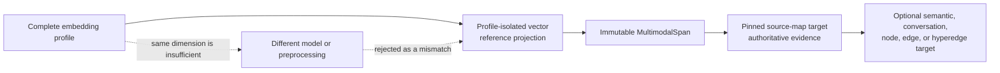
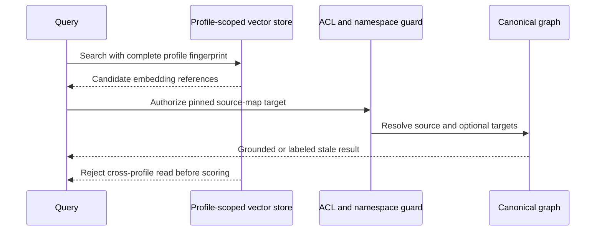

# ADR: Multimodal Evidence Reference Graph

## Status

Proposed implementation in the multimodal evidence feature branch.

## Decision

Kogwistar remains the owner of immutable evidence and generic graph-reference
contracts. LLM-Wiki remains the owner of embedding providers, vector indexes,
ACL-aware dereferencing, and application orchestration.

An embedding profile identifies a complete semantic space. Provider, model,
revision, preprocessing policy, embedding kind, metric, dimension, and patch
limits are part of that identity. Two profiles with the same dimension are not
interchangeable.

The projection flow is:

`MultimodalSpan` is source evidence, not a claim. A source revision and its
content hash are immutable. Text ranges, image regions, audio intervals, video
intervals, and per-frame video region tracks use typed locators. A video track
stores an immutable manifest reference and digest instead of an unbounded list
of frame boxes inside a graph entity.

An `EmbeddingReference` stores the profile fingerprint, embedding-set ID,
source span, and typed target references. It stores no vectors and no query
scores. A late-interaction set such as 200 ColQwen vectors therefore remains
one embedding set and one source reference, rather than becoming 200 graph
nodes.

The source-map target is authoritative and must be pinned. Semantic,
conversation, node, edge, and hyperedge targets are optional derived links.
Similarity alone never creates canonical graph truth.

## Compatibility And Safety

Existing text `Span` and `Grounding.spans` payloads remain valid. Grounding is
valid only when it contains at least one text or multimodal span. Flattened
payloads gain additive multimodal span tables and IDs; old payloads without
those fields continue to load.

LLM-Wiki validates workspace and namespace authorization before dereferencing
source-map or semantic targets. Stale and unauthorized references are returned
as labeled retrieval results. They are not silently redirected or rewritten.

Vector stores are profile-scoped and reject profile mismatches before writes or
queries. Canonical graph/source/conversation storage is independent of vector
projection lifetime.

## Consequences

- Core models can represent multimodal evidence without embedding-provider code.
- LLM-Wiki can support dense, audio/video, and late-interaction retrieval using
  the same reference shape.
- Existing source and graph invariants remain the authority for truth,
  provenance, namespaces, and ACLs.
- Legacy free-form locators remain readable but unsupported legacy forms must
  be converted before new indexing.
