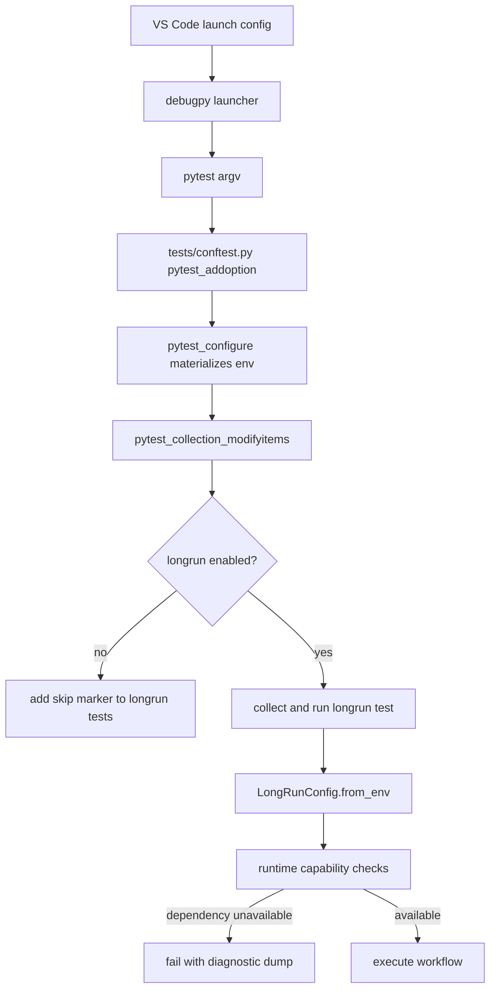

# ADR: Pytest And VS Code Long-Run Activation

## Status
Accepted.

## Context
The long-run workflow test is expensive and intentionally opt-in. It is commonly
started from VS Code launch configurations, which run:

```text
python debugpy/launcher ... -- -m pytest <nodeid> <pytest args>
```

Earlier iterations mixed several meanings:

- VS Code launch environment variables
- pytest command-line options
- test-body `pytest.skip(...)` gates
- node-id / `sys.argv` inference
- runtime capability checks such as Ollama availability

That made a direct VS Code launch capable of producing a quiet `s` even when the
user clearly intended to run the long-run test.

## Decision
Use pytest configuration as the single source of truth for long-run test
selection.

- `--kogwistar-longrun` means the user intentionally requested long-run tests.
- `--kogwistar-longrun-probe=<name>` means the user intentionally requested a
  named long-run probe environment.
- `KOGWISTAR_LLM_WIKI_LONGRUN=1` remains supported for terminal compatibility.
- `tests/conftest.py` is the only place that decides whether marked `longrun`
  tests are collection-enabled.
- The long-run test body must not infer intent from `sys.argv` or node ids.
- After a long-run test is explicitly enabled, missing runtime dependencies
  should fail with diagnostics instead of becoming a quiet test skip.

## Mental Model



## Why This Boundary
VS Code environment injection is useful, but it is not the best authority for
test selection because debug launchers, terminals, and pytest plugins can all
reshape process state. Pytest arguments are visible in the command line and are
handled before test modules execute, so they are the clearest place to express
test intent.

Environment variables remain useful for runtime configuration after pytest has
accepted the test. They should carry provider, model, backend, and budget
settings, not be the only proof that the user meant to run the suite.

## Policy
- Selection policy lives in `tests/conftest.py`.
- Runtime configuration lives in `LongRunConfig.from_env()`.
- Capability checks live near the long-run test or fixture that needs the
  capability.
- Explicitly enabled long-run runs should fail for missing required runtime
  services or libraries.
- Disabled long-run tests may be skipped at collection with a clear reason.

## Consequences
- Running a VS Code long-run launch shows `--kogwistar-longrun` in the pytest
  command line.
- Running the long-run node id without opt-in is skipped centrally with one
  clear reason.
- Running with opt-in reaches the test body and live traces.
- Missing Ollama, provider libraries, or configured services are treated as
  real execution failures for explicitly requested long-run runs.

## Related Files
- `.vscode/launch.json`
- `tests/conftest.py`
- `tests/integration/test_longrun_workflow_ingestion.py`
- `doc/longrun_workflow_test.md`
