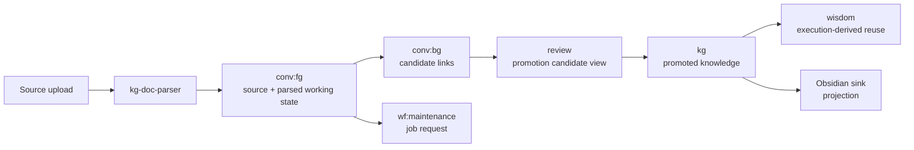

# LLM-Wiki Architecture Design (Kogwistar-based) — Revised

## 1. Overview

This document defines the architecture for **LLM-Wiki**, a knowledge system built on **Kogwistar** as the authoritative substrate.

### Core Princi- **Graph-authoritative**: All state lives in Kogwistar (events → projections)

- **Projection-based UI**: Obsidian and app UI are views, not sources of truth

- **Deterministic ingestion**: Stable identities for all inputs and derivations

- **Separation of concerns**:
  - Conversation Graph = working memory
  - Knowledge Graph = promoted, durable knowledge
  - **Maintenance Domain = system maintenance semantics across graph kinds (NOT a core graph kind)**

- **Wisdom is not a graph**:
  - Wisdom = reusable, execution-derived knowledge (artifact type)

- **Continuous compilation**:
  - raw → structured → linked → consolidated → projected

Target outcome aligns with Karpathy-style LLM-wiki:

- Raw sources in
- Interlinked wiki out
- Continuously maintained



---

## 2. System Components

### 2.1 Core Engine (Kogwistar)

Responsibilities:

- Event sourcing (append-only)
- Unified graph model (nodes/edges)
- CDC / ChangeBus
- Workflow runtime
- Projection triggers
- Namespace-aware replay and repair
- Provenance-first graph storage

---

### 2.2 Ingestion Layer

Current:

- `kg-doc-parser` (transitional)

Responsibilities:

- Parse documents (PDF, OCR, markdown, etc.)
- Extract structure (sections, entities, tables)
- Emit grounded artifacts into conversation-oriented state

Future:

- Gradual absorption into Kogwistar-native workflows

---

### 2.3 Background Agent System

#### Hot Path (Ingestion Loop)

Triggered by:

- File upload
- New conversation
- Explicit user action

Responsibilities:

- Extract structure + entities
- Generate candidate links
- Populate conversation-oriented artifacts
- Trigger follow-up maintenance

---

#### Cold Path (Consolidation Loop)

Triggered when:

- System idle
- Scheduled runs

Responsibilities:

- Merge duplicates
- Promote knowledge
- Strengthen links
- Detect contradictions
- Generate synthesis artifacts
- **Derive wisdom from execution history**

---

### 2.4 Projection Layer

#### Obsidian Sink

- Deterministic graph → markdown projection
- Modes:
  - Full rebuild
  - Incremental CDC
- Guarantees:
  - Stable file mapping
  - Idempotent updates
  - Controlled editable zones

---

### 2.5 Application UI

simple CLI, if ui later added, first draft is a tkinter click button representing the command as a short cut. Probably as a visual cheatsheet of cli.

---

## 3. Graph Model

### 3.1 Graph Spaces

### 3.1.1 Conversation Graph

Purpose:

- Working memory
- Chronological reasoning
- Artifacts to derive wisdom and new knowledge
- Interactive foreground and maintenance-background conversation lanes

Contains:

- User/assistant messages
- Intermediate summaries
- Candidate links
- Derived (non-promoted) outputs
- Maintenance critique / rationale artifacts when modeled conversation-style

Notes:

- Foreground vs background should be expressed by namespace and metadata, not by introducing new core graph kinds
- Example namespaces:
  - `ws:{workspace_id}:conv:fg`
  - `ws:{workspace_id}:conv:bg`

---

### 3.1.2 Knowledge Graph (KG)

Purpose:

- Stable, promoted knowledge
- Source of truth for projection

Contains:

- Entities
- Relationships
- Topic pages
- Validated facts
- Accepted contradiction markers or durable maintenance outcomes where policy allows

---

### 3.1.3 Maintenance Domain (Revised)

Purpose:

- **System maintenance semantics**
- Knowledge curation and upkeep
- Cross-graph evaluation, critique, candidate generation, and decision support

Important:

- **Maintenance is NOT currently a core graph kind in Kogwistar**
- Maintenance is an application semantic domain that may be represented across:
  - workflow
  - conversation
  - knowledge
  - wisdom

Typical maintenance artifacts may include:

- maintenance job requests and runs
- candidate links
- merge suggestions
- contradiction scans
- credibility / reliability critiques
- promotion candidates
- review items
- synthesis refresh requests

Properties:

- Ephemeral or revisable until promoted
- Model-dependent
- Not authoritative truth by default
- Not projected directly to Obsidian by default

---

## 4. Wisdom (Re-defined)

### 4.1 Definition

Wisdom is:

> **Reusable, generalized knowledge about how to solve problems, derived from execution and outcomes**

It is **NOT**:

- link suggestions
- clustering
- graph structure
- inference artifacts

---

### 4.2 Source of Wisdom

```text
workflow execution
    ↓
provenance + outcomes
    ↓
pattern extraction / reflection
    ↓
wisdom artifact
```

---

### 4.3 Wisdom Characteristics

- Cross-context reusable
- Derived from real execution
- Improves future decisions
- Low-noise, high-value
- Explicitly traceable to evidence

---

### 4.4 Examples

❌ Not wisdom:

- "Doc A links to Doc B"

✅ Wisdom:

- "Section-level anchors outperform full-document embeddings for entity resolution"
- "OCR-first pipelines degrade table extraction accuracy on scanned financial PDFs"

---

### 4.5 Representation


Wisdom is:
a collection / namespace / projection of nodes + edges
with specific semantics
derived from execution and outcomes

---

## 5. Identity & Determinism

Kogwistar stable_id

## 6. Cross-Link Semantics

### 6.1 Link Families
represented as edges with edge metadata or new edge class

#### A. Source-native Links

- From document structure
- Highest evidence

#### B. User-authored Links

- Explicit human intent
- High signal

#### C. Agent-inferred Links

- Generated via models
- Require validation

#### D. Maintenance Links

- System-generated candidates, assessments, or decisions
- May originate in workflow, conversation, or knowledge contexts depending on use case

---

## 7. Cross-Space Semantics

refer to how kogwistar conversation refer to knowledge
pin- (ref) from source, and edge from it, edge in source can also be pin as edge.

## 8. Promotion Rules

### 8.1 Criteria

Promotion (Conversation / Maintenance artifacts → KG) requires:

- Evidence support (source or multi-signal)
- No unresolved contradictions at the required confidence threshold
- Confidence threshold met
- Optional user approval

---

### 8.2 Flow

1. Extract → conversation-oriented artifacts
2. Maintenance domain generates candidates
3. Evaluation
4. Promotion decision
5. KG update event
6. Projection update

---

## 9. Background Maintenance Jobs

### 9.1 Types

- Entity resolution
- Duplicate merge
- Link validation
- Clustering
- Contradiction detection
- Topic synthesis
- Staleness detection
- **Wisdom extraction**

---

### 9.2 Execution

- Token-based runtime (Kogwistar)
- Queue scheduling
- Idle prioritization
- Namespace-scoped execution where helpful
- Lane-aware routing as app policy

---

## 10. Update & Delete Semantics

### 10.1 Structural Update

Updates should normally be modeled as:

- append event
- create new version or replacement artifact
- link via `supersedes` or equivalent derivation relation

Examples:

- improved synthesis summary
- refined relation
- updated contradiction set

---

### 10.2 Structural Delete

Normal delete path should **not** be physical removal.

Use:

- `tombstoned` or equivalent delete event / projection hiding at the structural level
- supersession where the old artifact remains in history
- UI-level hiding where only presentation changes

Hard delete should be rare and reserved for admin / repair / legal cases.

---

### 10.3 Application Lifecycle vs Structural Lifecycle

Do not mix application decisions with structural state.

Structural lifecycle examples:

- active
- superseded
- tombstoned

Application lifecycle examples: (May not need to exist when coding implementing, just examples)

- candidate
- needs_review
- accepted
- rejected

Important:

- Terms like `rejected` are **application semantics**, not core Kogwistar lifecycle semantics


---

## 11. Obsidian Projection Model

### 11.1 Projection Scope

Include:

- Accepted KG nodes
- Selected synthesis artifacts

Exclude by default (but need to be able to opt-in):

- Raw conversation nodes
- Raw maintenance artifacts
- Unreviewed candidates

---

### 11.2 File Mapping

```text
kg_id → deterministic file path
```

---

### 11.3 Update Modes

- Full rebuild
- Incremental CDC

---

## 12. UI Model

### 12.1 Views

- Add (ingestion)
- Parse (structure)
- Organize (curation)
- Knowledge (KG)
- Maintenance (system maintenance semantics)
- Obsidian (projection)
- Agent (jobs + control)

---

### 12.2 UX Requirements

- Clear distinction:
  - source vs user vs agent
- Provenance visibility
- Promotion control
- Inspectability ("why link exists")
- Lane-aware views:
  - foreground conversation
  - background maintenance
  - review queue

---

## 13. CDC & Event Flow

1. Event appended to Kogwistar
2. ChangeBus emits
3. Consumers react
4. Obsidian sink updates
5. UI refreshes

Cross-lane communication should preferably be modeled as:

- graph artifact creation in receiver-owned namespace
- plus event emission
- rather than hidden out-of-band transport

---

## 14. Design Invariants

- Append-only event model
- Graph is authoritative
- Projections are rebuildable
- Deterministic IDs everywhere
- **Maintenance ≠ Wisdom**
- Maintenance is a semantic domain, not currently a core graph kind
- Wisdom derived only from execution
- No silent promotion of agent output
- Provenance always preserved
- Update preserves lineage
- Delete preserves history

---

## 15. Summary

This system is:

- Not a chatbot
- Not a note app
- Not a RAG wrapper

It is:

**A continuously learning knowledge system where:**

- conversation = working memory and conversation-shaped critique
- maintenance = system maintenance semantics across graph kinds
- knowledge = stabilized truth
- wisdom = reusable experience
- obsidian = human-facing projection
s are rebuildable
* Deterministic IDs everywhere
* **Maintenance ≠ Wisdom**
* Wisdom derived only from execution
* No silent promotion of agent output
* Provenance always preserved

---

## 14. Summary

This system is:

* Not a chatbot
* Not a note app
* Not a RAG wrapper

It is:

**A continuously learning knowledge system where:**

* conversation = working memory
* maintenance = system reasoning
* knowledge = stabilized truth
* wisdom = reusable experience
* obsidian = human-facing projection
rebuildable
* Deterministic IDs everywhere
* **Maintenance ≠ Wisdom**
* Wisdom derived only from execution
* No silent promotion of agent output
* Provenance always preserved

---

## 14. Summary

This system is:

* Not a chatbot
* Not a note app
* Not a RAG wrapper

It is:

**A continuously learning knowledge system where:**

* conversation = working memory
* maintenance = system reasoning
* knowledge = stabilized truth
* wisdom = reusable experience
* obsidian = human-facing projection
e rebuildable
* Deterministic IDs everywhere
* **Maintenance ≠ Wisdom**
* Wisdom derived only from execution
* No silent promotion of agent output
* Provenance always preserved

---

## 14. Summary

This system is:

* Not a chatbot
* Not a note app
* Not a RAG wrapper

It is:

**A continuously learning knowledge system where:**

* conversation = working memory
* maintenance = system reasoning
* knowledge = stabilized truth
* wisdom = reusable experience
* obsidian = human-facing projection

---

END
