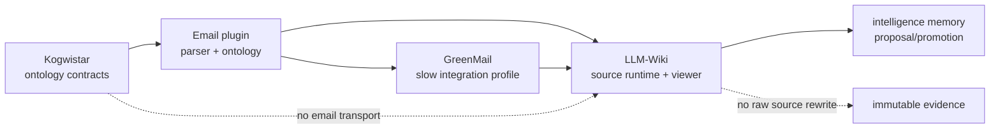
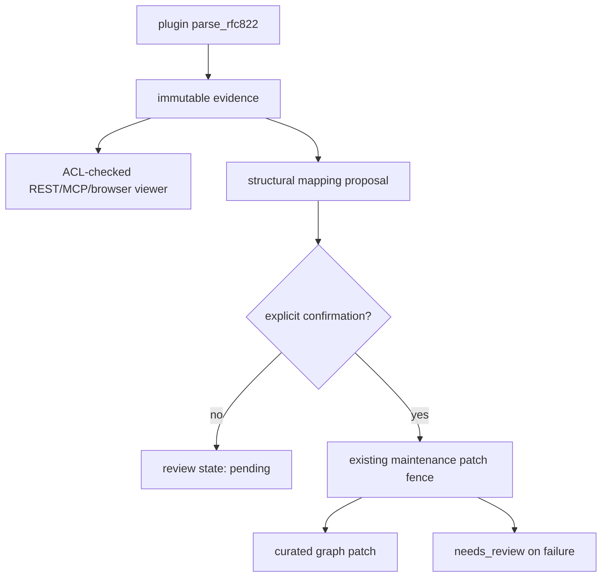

# Composable Ontology And Email Plugin Implementation Plan

This checklist implements
`doc/adr_composable_ontology_email_intelligence.md`. It is deliberately staged
to avoid mixing generic core contracts, mail transport, and LLM-Wiki policy in
one pull request.

## Delivery Dependency Diagram

The dependency direction is one-way. A downstream slice may consume a merged
upstream contract, but it must not pin an unmerged feature branch or move
email-specific transport back into Kogwistar core.

## Current Implementation Status

The first runtime slices are now present on the LLM-Wiki feature branch:

The remaining milestones below are deliberately still unchecked where the
corresponding durable connector registry, descriptor search integration, or
intelligence-memory promotion is not yet implemented.

Delivered in the current branch:

- [x] Immutable plugin-backed RFC822 evidence and structural mapping storage.
- [x] ACL-checked REST/MCP email viewer projection with escaped text output.
- [x] Durable review status with SQLite and in-memory implementations.
- [x] Explicit proposal/acceptance through the existing maintenance fence.
- [x] Browser email evidence panel and acceptance regression coverage.

## Current Capability Audit

- [x] Reuse Kogwistar `CatalogEntry` and `CatalogStore` for ACL-filtered
  ontology descriptor inventory and lexical/semantic candidate discovery.
- [x] Reuse Kogwistar multi-endpoint edges for ontology edge shapes; do not add
  a parallel hyperedge model.
- [x] Reuse `LogicalRef` for graph references to ontology descriptors.
- [x] Reuse `NamedProjectionStore` for active package/composition projections.
- [x] Reuse the search index for BM25 materialization.
- [x] Reuse LLM-Wiki immutable source revisions, parse generations, parse
  views, maintenance patches, and workspace namespaces.
- [x] Keep KG Doc Parser document-focused; no mailbox transport in that repo.
- [ ] Confirm whether catalog revision history is sufficient for immutable
  package audit, or whether a generic signed descriptor-bundle contract is
  required in core.
- [ ] Confirm endpoint role bindings can be represented without changing edge
  serialization and Rust parity. Prefer validated metadata plus existing
  endpoint IDs.

## Milestone 0: Issues, Branches, And Fixtures

- [ ] Keep this planning branch separate from active Kogwistar worktrees.
- [ ] Open one issue per milestone with explicit repository ownership.
- [ ] Create a fresh Kogwistar feature branch from merged `main` only when the
  minimal core contract is approved.
- [ ] Create the email plugin repository with independent CI, release, and
  dependency policy.
- [ ] Create a fresh LLM-Wiki feature branch from merged dependency revisions.
- [ ] Add sanitized synthetic RFC822 fixtures for plain text, HTML alternative,
  attachment, nested message, calendar invite, BCC, duplicate Message-ID,
  spoofed From, malformed headers, MIME recursion, and oversized payloads.
- [ ] Record fixture generation scripts so test data is reproducible.

Exit criteria: responsibilities and schemas are reviewed; no implementation
branch is based on unmerged dependency work.

## Milestone 1: Minimal Kogwistar Contracts

- [ ] Add immutable `OntologyPackageManifest` with package identity, content
  digest, scope, dependencies, exports, and provider metadata.
- [ ] Add discriminated ontology descriptors for class, property, relation,
  edge shape, mapping rule, and profile.
- [ ] Add deterministic descriptor and composed-view fingerprints.
- [ ] Add `OntologyPackageProvider` that emits `CatalogEntry` records rather
  than creating a second catalog.
- [ ] Add deterministic dependency resolution and composition.
- [ ] Fail closed on missing dependencies, cycles, namespace collisions,
  incompatible property types, cardinalities, or endpoint roles.
- [ ] Add payload and edge-shape validation against a composed view.
- [ ] Keep descriptor callbacks capability-named and trusted; reject arbitrary
  code embedded in package data.
- [ ] Add no email-specific symbols or dependencies to core.
- [ ] Verify the core API supports tenant/project ACL filtering before ranking.
- [ ] Verify the same descriptor can be materialized for graph traversal, BM25,
  and one profile-scoped semantic projection.

Tests:

- [ ] Manifest and every descriptor JSON round-trip.
- [ ] Package and view fingerprints are stable under key ordering.
- [ ] Composition order does not change the result.
- [ ] Identical descriptors coalesce; incompatible descriptors fail closed.
- [ ] Dependency cycles and missing pinned digests fail with useful diagnostics.
- [ ] Unauthorized descriptors are absent before lexical or semantic ranking.
- [ ] Existing catalog, glossary, graph, and search contracts remain unchanged.
- [ ] CPython 3.12-3.14, PyPy 3.11, lint, Rust/schema parity, and normal CI pass.

Exit criteria: Kogwistar PR is green, merged, and tagged before downstream
pins move.

## Milestone 2: Email Plugin Parser And Ontology

Repository: proposed `kogwistar-email-plugin`.

- [ ] Add source adapter protocols for RFC822 bytes, Maildir, mbox, and IMAP.
- [ ] Add `MailConnectorBinding` and deterministic stream ID derivation.
- [ ] Add IMAP cursor model with account, mailbox/folder, UIDVALIDITY, UID, and
  bounded resynchronization behavior.
- [ ] Parse RFC822/MIME deterministically with the standard `email` package.
- [ ] Preserve raw headers, normalized headers, defects, MIME tree, body
  alternatives, nested messages, and attachment manifests.
- [ ] Hash every raw message and attachment before emitting a derivation.
- [ ] Add parser limits for bytes, headers, parts, depth, attachments, and
  compressed content.
- [ ] Never fetch remote HTML resources or execute attachment content.
- [ ] Add structural mapping rules for envelope, participants, attachments,
  calendar invitations, explicit replies, and explicit references.
- [ ] Add semantic proposal schemas for thread heuristics, people,
  organizations, action items, commitments, and business concepts.
- [ ] Publish the reference email ontology package described by the ADR.
- [ ] Document that addresses and Message-ID values are claims, not ACL or
  authentication authority.

Tests:

- [ ] Same bytes and parser profile produce byte-for-byte equivalent output.
- [ ] Duplicate Message-ID messages retain distinct provider/source identities.
- [ ] UIDVALIDITY reset does not alias old provider identities.
- [ ] BCC, malformed headers, encoded words, timezones, multipart alternatives,
  nested messages, and attachments round-trip correctly.
- [ ] Parser defects are reported without mutating source bytes.
- [ ] MIME recursion and size bombs fail within configured bounds.
- [ ] Structural mappings validate against the composed email ontology.
- [ ] Ambiguous semantic mappings remain proposals.
- [ ] Normal CI runs on CPython 3.12-3.14 and PyPy 3.11 where dependencies
  permit; incompatible optional native extras are isolated and documented.

Exit criteria: parser and ontology package are released from a green tag; no
mail credentials or corpus data exist in build artifacts.

## Milestone 3: GreenMail Integration Profile

- [ ] Add an opt-in Compose file using a pinned GreenMail image digest.
- [ ] Expose only the ports required by the test profile.
- [ ] Create test users through configuration or the GreenMail API.
- [ ] Seed deterministic messages over SMTP so the connector observes a real
  delivery path.
- [ ] Exercise IMAP discovery, flags, folder moves, deletion/tombstone, and
  cursor restart.
- [ ] Keep GreenMail resource limits small and health-check before tests.
- [ ] Ensure logs do not contain message bodies, credentials, or BCC values.
- [ ] Mark container tests `slow`; keep parser fixtures in ordinary CI.

Acceptance scenario:

1. Start GreenMail and create two authorized mailbox bindings.
2. Send a three-message thread with one attachment and calendar invitation.
3. Send a duplicate Message-ID from a second mailbox and a spoofed From header.
4. Synchronize, stop the worker after cursor persistence, and restart it.
5. Change flags, move one message, and delete another.
6. Verify immutable source revisions and mailbox events.
7. Verify no cross-mailbox link is created without joint authorization.

Exit criteria: the real protocol path passes without requiring an external mail
provider.

## Milestone 4: LLM-Wiki Plugin Runtime

- [ ] Add plugin discovery and configuration for ontology packages and source
  connectors without importing optional plugins at base-package import time.
- [ ] Persist connector bindings and secret references separately from source
  evidence.
- [ ] Derive workspace namespaces and ACLs from the connector binding, never
  from message headers.
- [ ] Add durable synchronization jobs, leases, cursor CAS, retries, budgets,
  and idempotency keys.
- [ ] Store mailbox events in workflow/event state and raw RFC822 bytes as
  immutable source revisions.
- [ ] Store parser output as versioned derivation evidence.
- [ ] Select an authorized composed ontology view per binding/source.
- [ ] Search descriptors through exact/alias, shape compatibility, BM25, and
  one embedding-profile projection.
- [ ] Persist ontology mapping proposals with evidence, scores, package/view
  fingerprints, and plugin/model versions.
- [ ] Reuse maintenance proposal/acceptance fences for semantic facts.
- [ ] Materialize accepted facts using existing nodes and multi-endpoint edges.
- [ ] Schedule only affected projections and memories after acceptance.
- [ ] Keep ontology upgrades opt-in and targeted; no automatic corpus-wide
  remapping.
- [ ] Return explicit degraded status when an ontology package, semantic index,
  or parser capability is unavailable.

Tests:

- [ ] Two addresses in one authorized mailbox do not create two ACL streams.
- [ ] The same address in two connector bindings remains in two ACL scopes.
- [ ] ACL filtering occurs before ontology candidate ranking.
- [ ] Same-dimension embedding profiles cannot read each other's ontology
  projections or compare scores.
- [ ] Raw source and mailbox event history remain unchanged after remapping.
- [ ] Duplicate delivery before and after commit remains idempotent.
- [ ] Worker crash before source commit, parse commit, mapping commit, and
  cursor CAS is recoverable.
- [ ] BCC and unauthorized thread/entity links never appear in search results.
- [ ] Plugin uninstall leaves historical evidence readable and blocks new
  mapping with an explicit capability error.
- [ ] Existing ingest, archive, MCP, REST, maintenance, ACL, source revision,
  and multimodal suites remain green.

Exit criteria: full LLM-Wiki CI passes on CPython 3.12-3.14 and PyPy 3.11; slow
GreenMail tests pass in their dedicated job.

## Milestone 5: Intelligence Memory

- [ ] Define email memory proposal kinds separately from ontology descriptors.
- [ ] Require pinned source evidence and composed-view descriptor references.
- [ ] Derive memory ACL as the intersection/authorized derivation of every
  contributing source; never widen it to the workspace default.
- [ ] Add bounded candidates for action items, commitments, decisions,
  preferences, relationships, and project facts.
- [ ] Keep uncertain, contradicted, or stale items in review state.
- [ ] Use append-only correction plus supersession/tombstone links.
- [ ] Invalidate only memories dependent on changed accepted mappings.
- [ ] Ensure maintenance-originated writes do not recursively schedule another
  request maintenance thread.
- [ ] Record provider/model usage and budget counters without message content.

Tests:

- [ ] A request email proposes an action item but does not auto-accept it.
- [ ] An accepted commitment memory cites exact message/source evidence.
- [ ] A correction supersedes the interpretation without changing raw mail.
- [ ] Conflicting mail produces review-required state rather than overwrite.
- [ ] Cross-stream memory creation fails when the principal lacks either ACL.
- [ ] Ontology remap invalidates only dependent memories.

Exit criteria: memory behavior satisfies existing maintenance and source-truth
invariants and is independently switchable from email ingestion.

## Milestone 6: Optional Real-Corpus Evaluation

- [ ] Add a manual downloader/importer for the current CMU Enron release and
  selected CMU task subsets.
- [ ] Require explicit operator acceptance of privacy and provenance warnings.
- [ ] Verify a documented checksum and record dataset version locally.
- [ ] Default to bounded users, folders, dates, and message counts.
- [ ] Redact output reports and prohibit raw corpus files in CI artifacts.
- [ ] Measure parsing defects, duplicate identities, thread proposals, ontology
  candidate recall, accepted precision, graph connectivity, BM25 retrieval,
  semantic retrieval, memory proposal quality, wall time, and peak memory.
- [ ] Never use the corpus to assert sender authenticity.

Exit criteria: evaluation is reproducible from operator-supplied data and does
not alter ordinary CI, images, or release dependencies.

## Release And Dependency Order

1. Merge and tag the minimal Kogwistar ontology contracts after full CI.
2. Pin that merged tag/revision in the email plugin; merge and tag the plugin.
3. Update KG Doc Parser's Kogwistar pin only if dependency consistency requires
   it; no email behavior belongs there.
4. Pin merged Kogwistar and email-plugin releases in an LLM-Wiki feature branch.
5. Run all normal CI, PyPy, container, and GreenMail integration checks.
6. Merge LLM-Wiki only after every required check is green.
7. Perform version bumps and image publication in separate release commits.
8. After every push, monitor GitHub checks to completion before moving the next
   downstream pin.

## Explicit Non-Goals

- No universal business ontology in Kogwistar core.
- No email-address-derived ACL or namespace authority.
- No automatic trust of Message-ID, From, SPF, DKIM, or DMARC claims.
- No ontology package containing arbitrary executable code.
- No installation-order-dependent composition.
- No graph node per ontology-search vector.
- No cross-profile similarity or score merging.
- No raw-message mutation by parser, mapper, LLM, or maintenance worker.
- No automatic corpus-wide remap after a model or ontology upgrade.
- No Enron corpus bytes in Git, CI artifacts, packages, or Docker images.
- No direct work or release commits on `main`.
