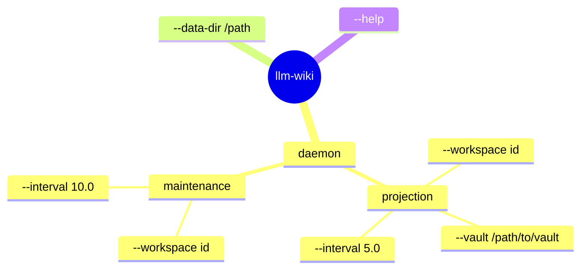
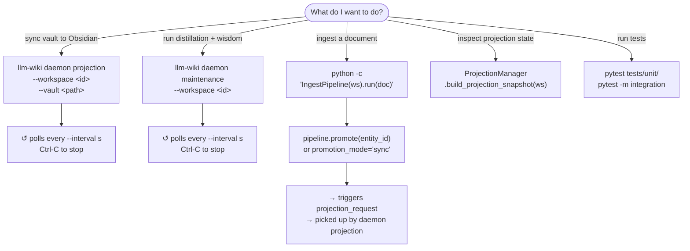
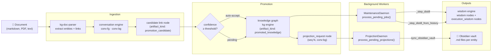
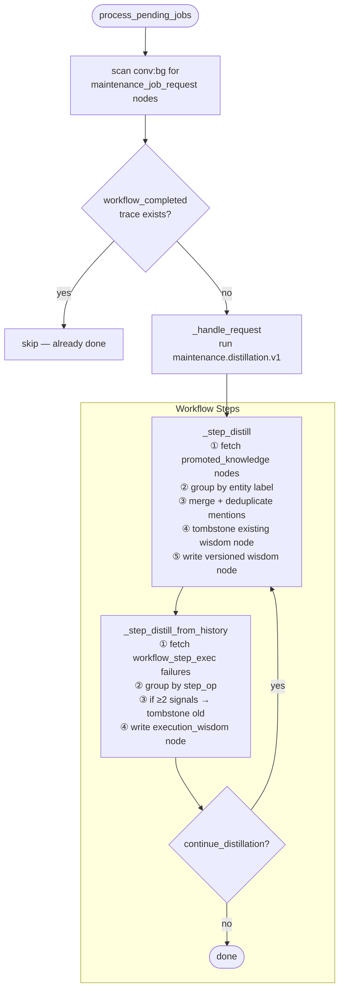
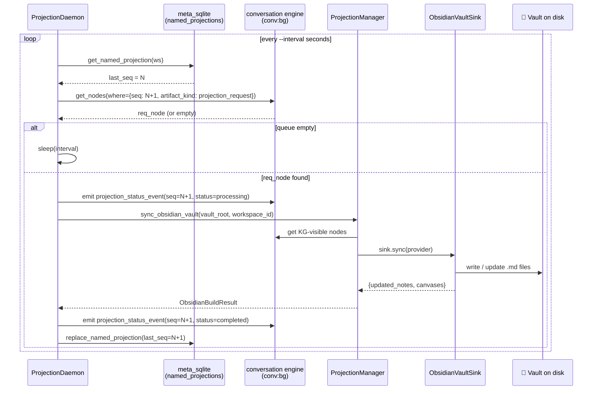
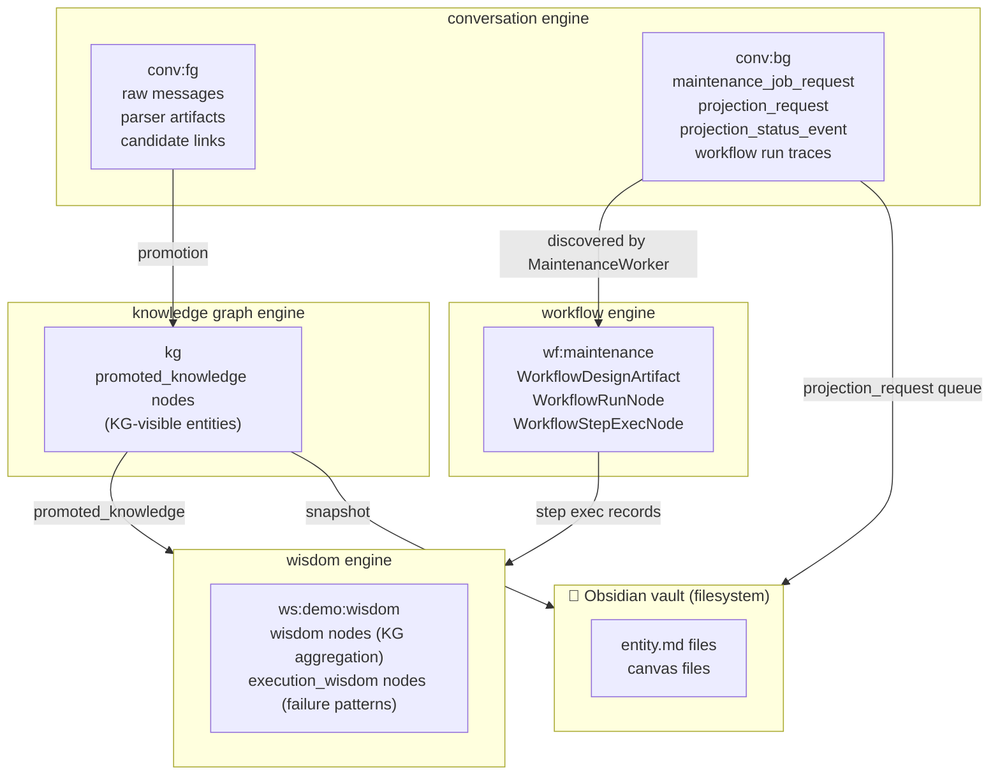

# LLM-Wiki — Diagrams

---

## CLI Spider Map

> Read from the centre outward. Each arm is a path through the CLI.



---

## CLI Decision Snowflake

> "What do I want to do?" — pick a branch.



---

## Full Pipeline — End to End



---

## Maintenance Worker — Distillation Algorithm



---

## Projection Worker — Queue Drain Algorithm



---

## CoW Namespace Proxy — How `_temporary_namespace` works

```mermaid
flowchart LR
    subgraph Before
        direction TB
        S1[read._e] --> E[engine\nnamespace='default']
        S2[write._e] --> E
        S3[indexing.engine] --> E
    end

    subgraph Inside _temporary_namespace block
        direction TB
        P["_NamespacedEngineProxy\nnamespace='ws:demo:conv_bg'\n(real engine untouched)"]
        S4[read._e] --> P
        S5[write._e] --> P
        S6[indexing.engine] --> P
        P -.delegates all else.-> E2[engine\nnamespace='default'\n(unchanged)"]
    end

    subgraph After
        direction TB
        S7[read._e] --> E3[engine\nnamespace='default']
        S8[write._e] --> E3
        S9[indexing.engine] --> E3
    end

    Before --> |"with _temporary_namespace(engine, 'ws:demo:conv_bg'):"| Inside _temporary_namespace block
    Inside _temporary_namespace block --> |"block exits (or raises)"| After
```

---

## Graph Space Map — Where Data Lives


