# LLM-Wiki — Diagrams

---

## CLI Spider Map

> Read from the centre outward. Each arm is a path through the CLI.

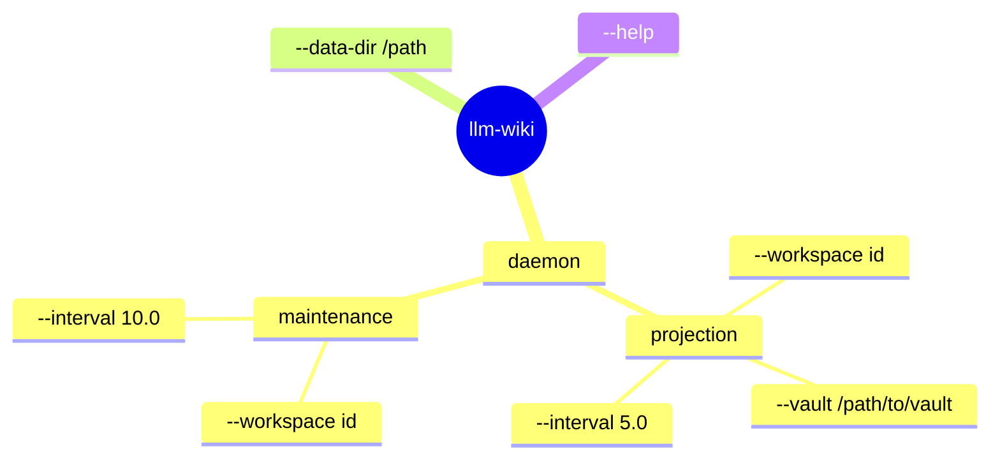

---

## CLI Decision Snowflake

> "What do I want to do?" — pick a branch.


---

## Full Pipeline — End to End

```mermaid
flowchart LR
    DOC["📄 Document\n(markdown, PDF, text)"]

    subgraph Ingestion
        PARSE["kg-doc-parser\nextract entities + links"]
        CONV["conversation engine\nconv:fg  ·  conv:bg"]
        CAND["candidate link node\n(artifact_kind: promotion_candidate)"]
    end

    subgraph Promotion
        REVIEW{"confidence\n≥ threshold?"}
        KG["knowledge graph\nkg engine\n(artifact_kind: promoted_knowledge)"]
        PREQ["projection_request node\n(seq N, conv:bg)"]
    end

    subgraph Background Workers
        direction TB
        MW["MaintenanceDaemon\nprocess_pending_jobs()"]
        PW["ProjectionDaemon\nprocess_pending_projections()"]
    end

    subgraph Outputs
        WISDOM["wisdom engine\nwisdom nodes +\nexecution_wisdom nodes"]
        VAULT["📁 Obsidian vault\n.md files per entity"]
    end

    DOC --> PARSE --> CONV --> CAND
    CAND --> REVIEW
    REVIEW -->|auto-accept| KG
    REVIEW -->|pending| KG
    KG --> PREQ
    KG --> MW
    PREQ --> PW
    MW -->|_step_distill| WISDOM
    MW -->|derive_problem_solving_wisdom_from_history| WISDOM
    PW -->|sync_obsidian_vault| VAULT
```

---

## Maintenance Worker — Distillation Algorithm

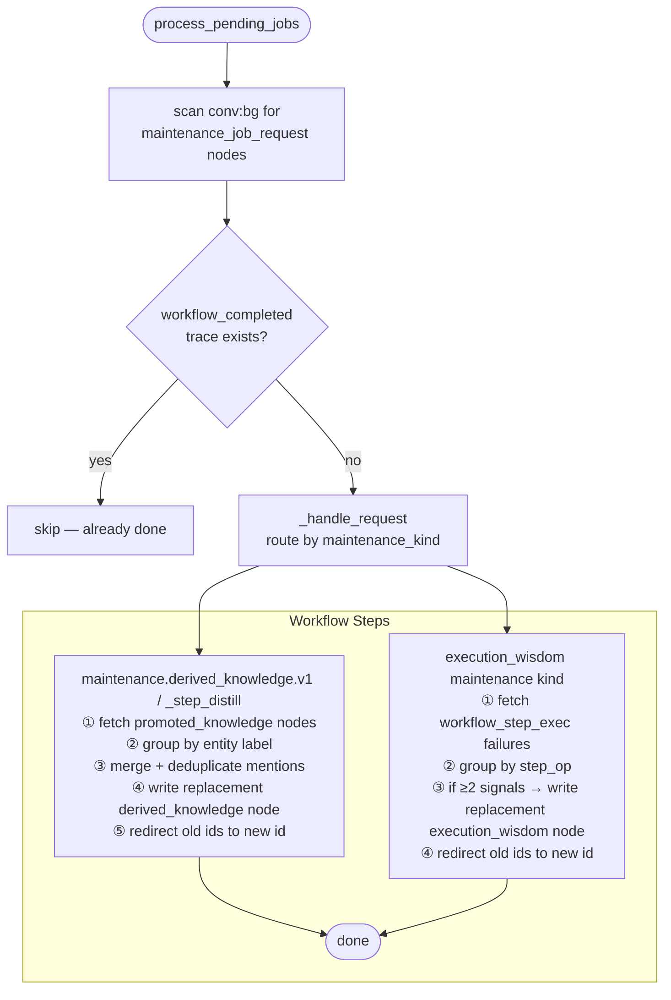

---

## Projection Worker — Queue Drain Algorithm

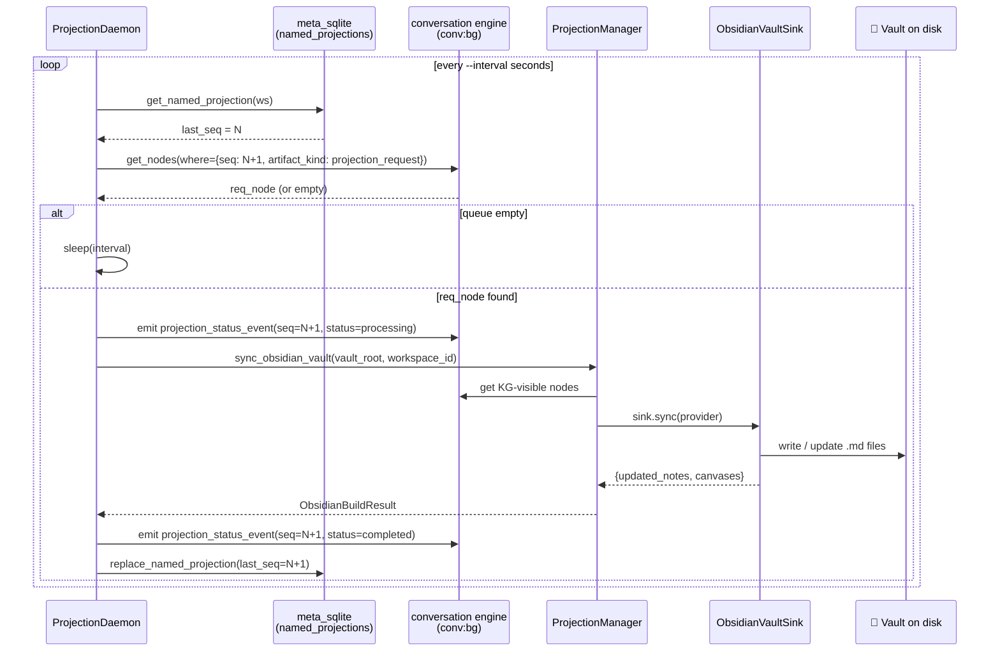

---

## CoW Namespace Proxy — How `_temporary_namespace` works

```mermaid
flowchart LR
    subgraph Before
        direction TB
        S1[read._e] --> E[engine\nnamespace='default']
        S2[write._e] --> E
        S3[indexing.engine] --> E
    end

    subgraph Inside _temporary_namespace block
        direction TB
        P["_NamespacedEngineProxy\nnamespace='ws:demo:conv_bg'\n(real engine untouched)"]
        S4[read._e] --> P
        S5[write._e] --> P
        S6[indexing.engine] --> P
        P -.delegates all else.-> E2[engine\nnamespace='default'\n(unchanged)"]
    end

    subgraph After
        direction TB
        S7[read._e] --> E3[engine\nnamespace='default']
        S8[write._e] --> E3
        S9[indexing.engine] --> E3
    end

    Before --> |"with _temporary_namespace(engine, 'ws:demo:conv_bg'):"| Inside _temporary_namespace block
    Inside _temporary_namespace block --> |"block exits (or raises)"| After
```

---

## Graph Space Map — Where Data Lives

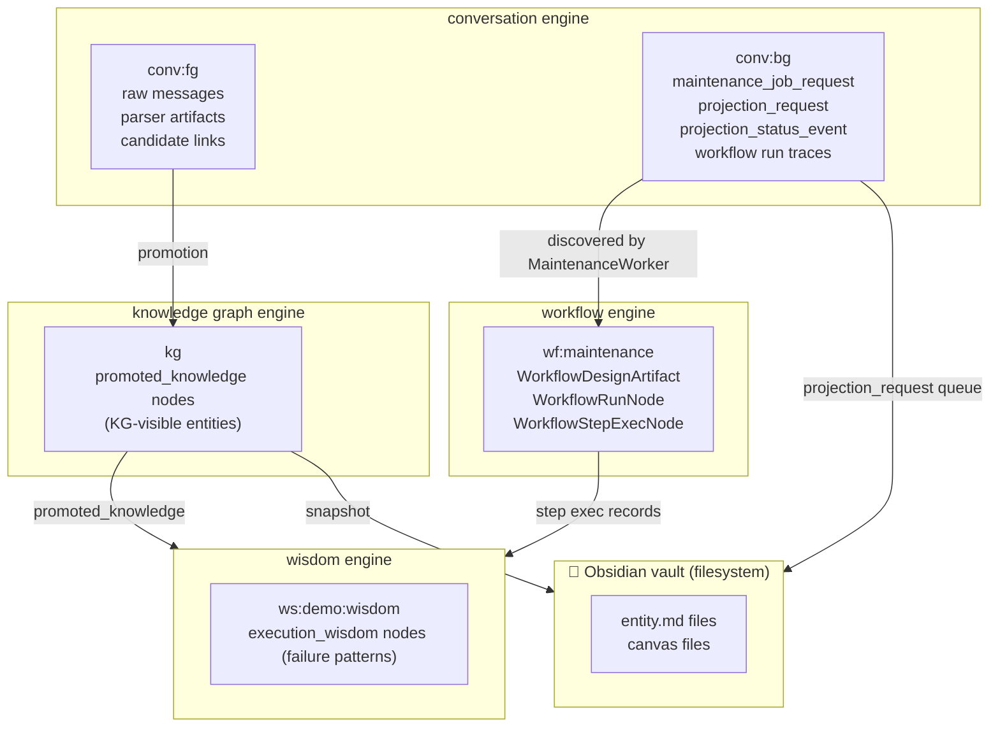

---

## Durable Job Queue Facade

```mermaid
flowchart LR
    APP["llm-wiki workers / ingest"]
    JOBS["engine.jobs\n typed facade"]
    META["meta store\n index_jobs"]
    WORKER["MaintenanceWorker /\nProjectionWorker"]

    APP -->|enqueue job_id + namespace + payload| JOBS
    JOBS -->|preserve coalescing\nnamespace/entity/job kind| META
    WORKER -->|claim(namespace)| JOBS
    JOBS -->|lease rows| META
    WORKER -->|mark_done / retry_or_fail| JOBS
    JOBS -->|DONE / retry / FAILED| META
```

---

## Lane Message Projection Repair

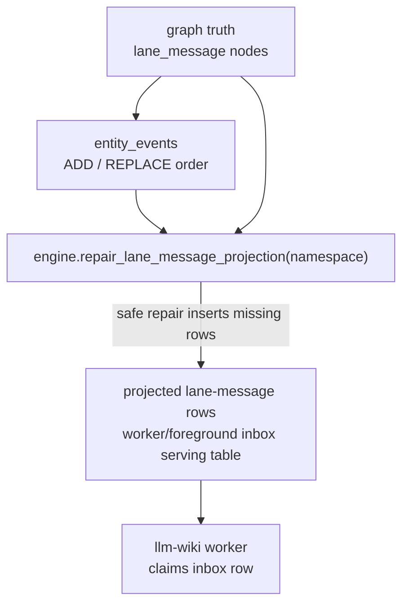

---

## Promotion Convergence Happy Path

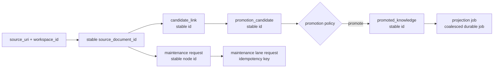

---

## Core Lane Idempotency

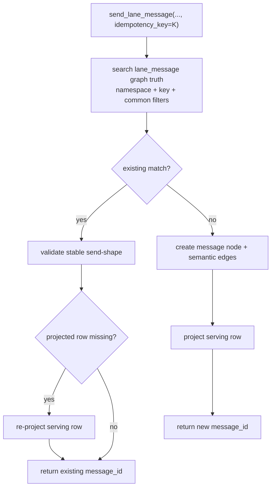

---

## Normal Convergent Happy Path

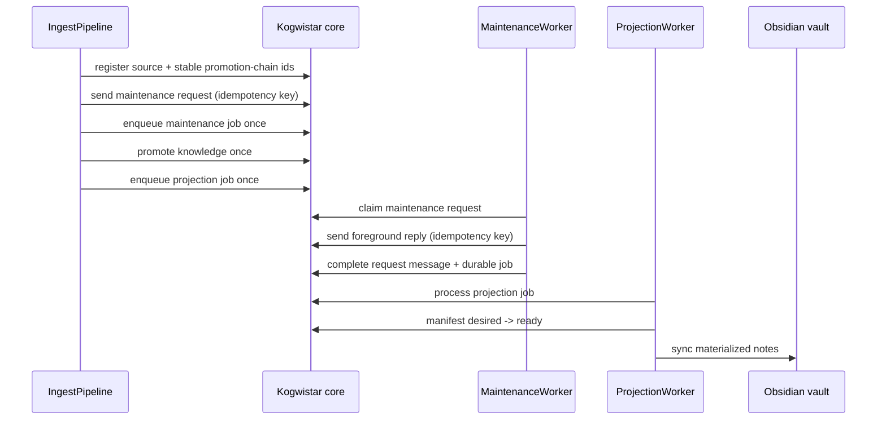

---

## Runtime Lane Lifecycle To SSE

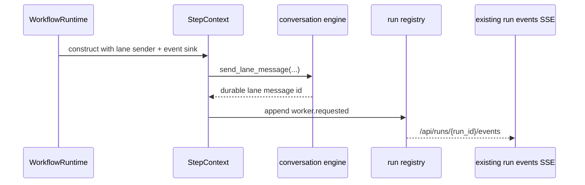

---

## Startup Recovery Coordinator

Wording note:

- Workflow is what runs. Runtime is how it runs. Service health is which
  long-running operational process is alive.
- The recovery surface inspects service health as an operator-visible latest
  state. It is not a universal actor or capability registry.

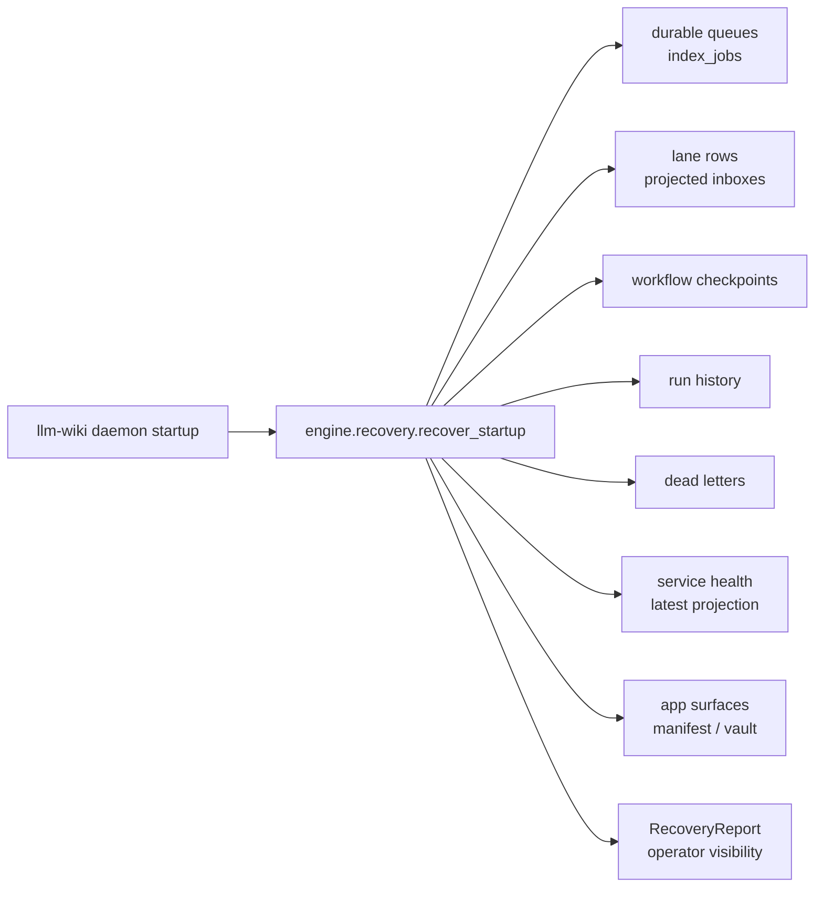

---

## Knowledge Policy Boundary

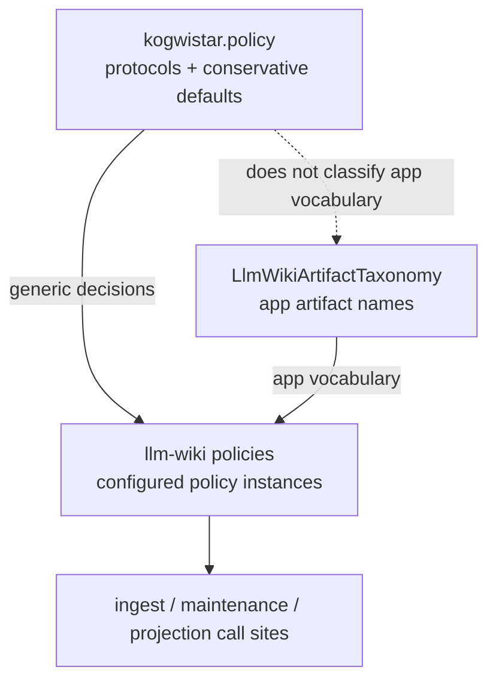

---

## Service Health Registry

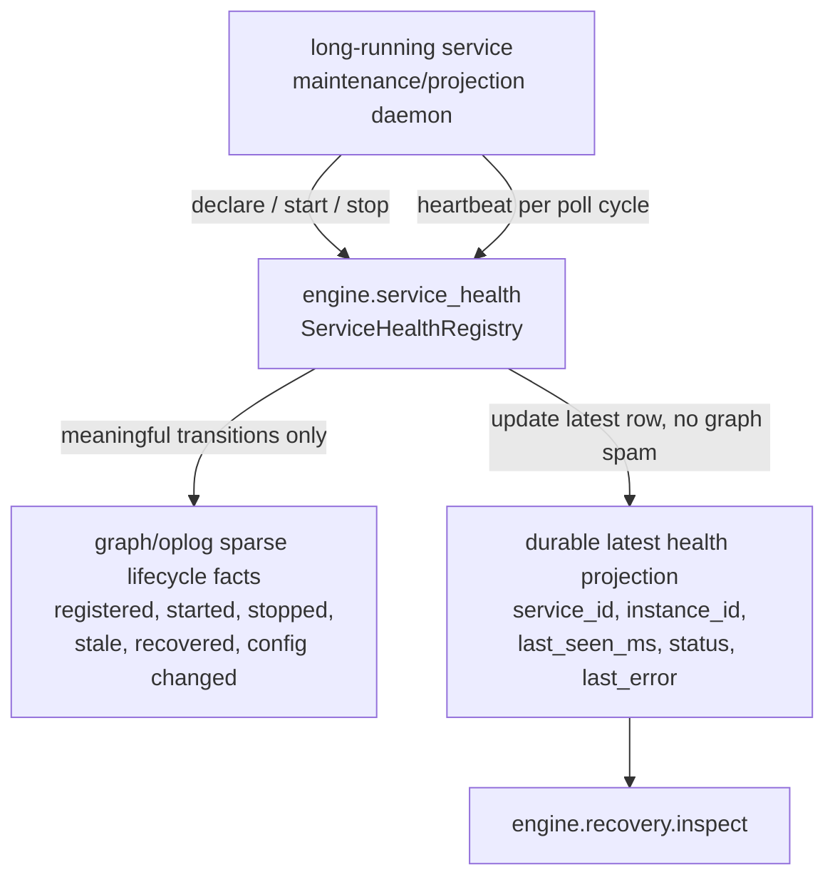

---

## Long-Run Workflow Test

The long-run workflow test is an opt-in diagnostic harness, not a production
command. It uses runtime workflow execution for each document and a bounded
daemon-like loop to observe background maintenance and projection state.

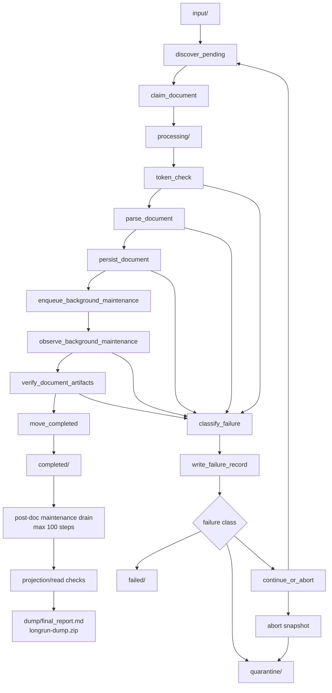

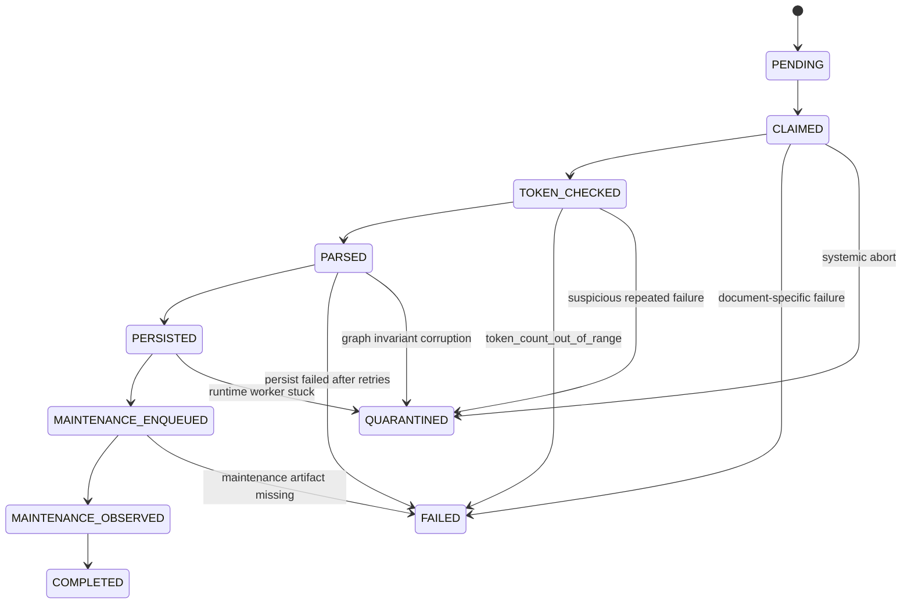
