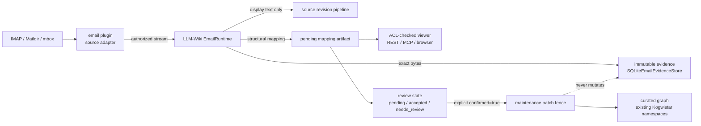
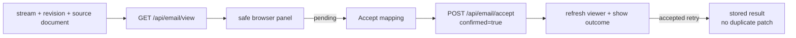

# Email Plugin And Viewer

LLM-Wiki treats email as an optional source plugin. Install
`kogwistar-email-plugin` separately, then use `EmailRuntime` to parse one
immutable RFC822 message and derive structural proposals.

## Runtime Boundaries



The solid path is the product data flow. The dotted constraint is a source
truth invariant: parsing, mapping, maintenance, and the viewer may derive or
display interpretations, but none may rewrite the original RFC822 bytes.

```python
from kogwistar_llm_wiki.email import EmailIngestRequest, EmailRuntime, SQLiteEmailEvidenceStore

runtime = EmailRuntime(
    pipeline=pipeline,
    store=SQLiteEmailEvidenceStore("email-evidence.sqlite3"),
    authorize_stream=lambda workspace_id, stream_id: connector_acl.allows(
        workspace_id, stream_id
    ),
)
result = runtime.ingest(
    EmailIngestRequest(
        workspace_id="acme",
        stream_id="mailbox-stream-id",
        source_key="uid:123",
        source_revision_id="imap:uidvalidity:123",
        raw_bytes=raw_rfc822_bytes,
    )
)
```

`EmailRuntime` stores the exact bytes and parser/mapping payloads under the
workspace and source revision. It registers only the display text through the
existing immutable source-revision pipeline and writes an internal
`email_structural_mapping` evidence artifact with `acceptance_status=pending`.
It never creates accepted knowledge, memories, or graph relations.

Use `WorkbenchApi.view_email(...)` or the read-only MCP `email_view` tool to
render an authorized message. The viewer checks workspace and stream scope,
returns a structured text projection, escapes its HTML preview, and labels
structural proposals with their review state (`pending`, `accepted`, or
`needs_review`). Review state is mutable app-owned state and is kept separate
from immutable evidence. Email headers are evidence claims, not ACL authority.
The viewer does not return raw bytes or execute HTML.

The browser workbench exposes the same projection through the **Email evidence**
panel. It accepts `workspace_id` from the active workspace and asks the user
for the stream and immutable source revision. The panel renders the returned
`body_text` as text, never with `dangerouslySetInnerHTML`, and only enables
acceptance after a source document ID is supplied.



Use `WorkbenchApi.propose_email_mapping(...)`, the read-only `email_propose`
tool, or `GET /api/email/proposal` to inspect the deterministic maintenance
patch. Applying it requires the explicit `email_accept`/`POST /api/email/accept`
confirmation. The existing maintenance patch validator enforces workspace
scope, provenance, idempotent IDs, and the invariant that raw source facts are
never rewritten. An accepted mapping is recorded by
`InMemoryEmailReviewStateStore` by default, or by
`SQLiteEmailReviewStateStore` for restart-safe operation. Repeating an
accepted request returns the stored result without applying the patch again.

For production, configure `SQLiteEmailEvidenceStore` (or another implementation
of `EmailEvidenceStore`) rather than the default in-memory store.

`EmailSyncService` provides bounded cursor synchronization. It calls a plugin
source adapter with the last snapshot, ingests all returned immutable messages,
and commits the next snapshot only after the whole batch succeeds. Failures
leave the prior snapshot in place so the batch can be replayed idempotently.
Use `SQLiteEmailSyncStateStore` with the plugin's snapshot class for
restart-safe local operation. Connector binding policy, ontology composition,
semantic search, and intelligence-memory promotion remain later slices.

## Review And Acceptance Sequence

```mermaid
sequenceDiagram
    participant U as User or Codex
    participant V as Viewer API
    participant S as Evidence store
    participant R as Review state
    participant M as Maintenance fence
    participant G as Curated graph

    U->>V: email_view(workspace, stream, revision)
    V->>S: read immutable evidence
    V->>R: read mapping status
    R-->>V: pending / accepted / needs_review
    V-->>U: escaped text + proposals + status
    U->>V: email_accept(confirmed=false)
    V->>R: persist pending review
    V-->>U: confirmation_required + patch preview
    U->>V: email_accept(confirmed=true)
    V->>M: validate scope, provenance, raw-fact fence
    M->>G: apply deterministic patch
    M-->>V: applied or needs_review result
    V->>R: persist final review state
    V-->>U: result; retries are idempotent
```
