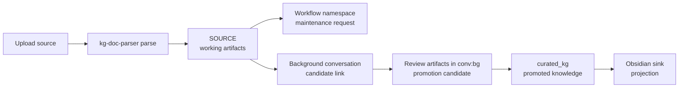

# Happy Paths

## Ingest -> Knowledge

upload -> parse -> ingest -> maintenance -> promotion -> projection

Regular ingest does not imply the same immediate `curated_kg` shape as the demo view.
The demo path now renders from `BASE_KG` through explicit graph-space reads so
the one-process walkthrough stays aligned with the same source/base write path
as normal ingest while still keeping the vault readable.

## Consolidation

idle -> maintenance -> merge candidates -> review -> update curated_kg

## Contradiction

detect -> create contradiction -> review -> resolve

## Wisdom

aggregate -> detect pattern -> create wisdom
