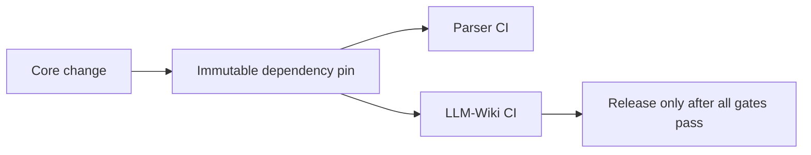

# Inter-Repo Update (Maintenance Revision)

## Key Change

Maintenance is NOT a graph kind.

## Updated Responsibilities

### Kogwistar
- maintenance system primitives
- workflow execution
- event sourcing

### LLM-Wiki
- maintenance policy
- artifact mapping
- lane semantics

### Parser
- extraction only

### Sink
- projection only

## Result

Cleaner separation:
- system vs policy
