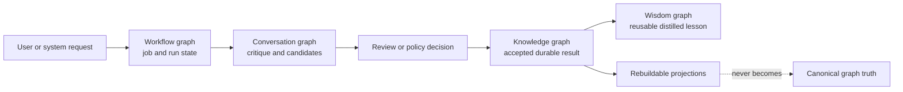

# Maintenance Ontology

Maintenance is a semantic layer.

Mapping:

- workflow → jobs
- conversation → critique
- knowledge → accepted results
- wisdom → distilled insight

Rule:
Maintenance artifacts evolve across graph kinds.

The arrows describe artifact promotion, not graph mutation shortcuts. Each
transition remains subject to provenance, workspace scope, namespace ACLs, and
the existing proposal and acceptance fences.
