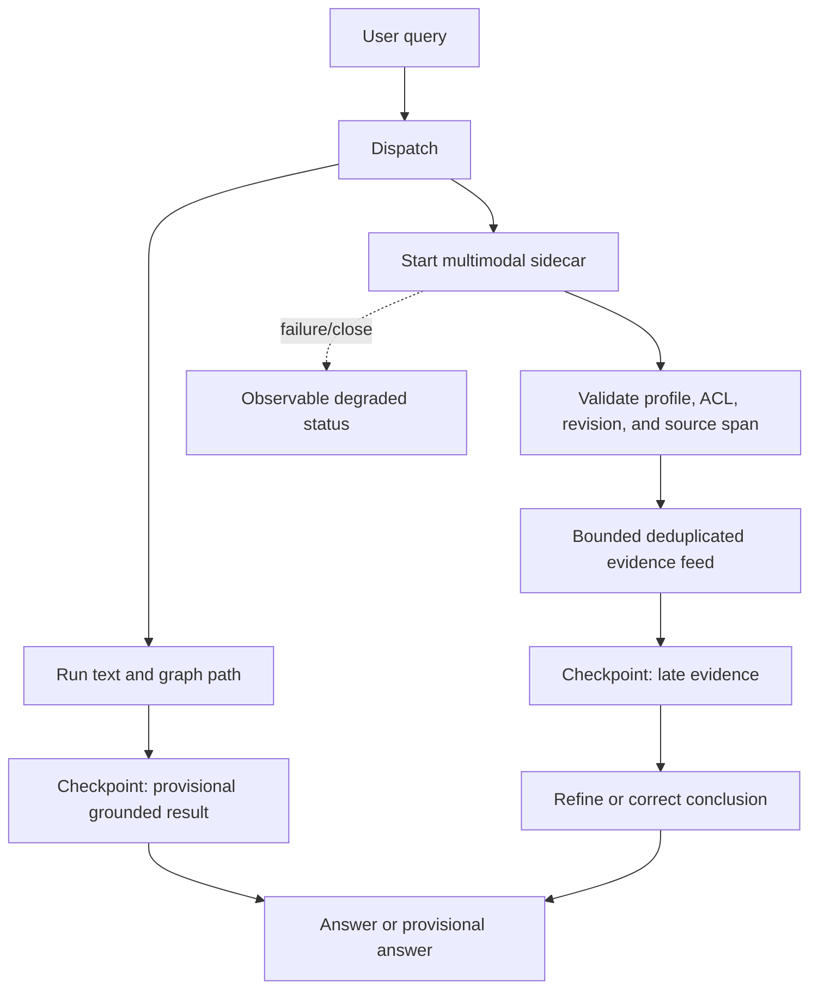

# Multimodal Retrieval Experiment

## Question

Does asynchronous multimodal retrieval let the main worker complete useful
text/graph work while native shared-space retrieval is running, and can late
visual evidence safely correct a provisional conclusion?

This remains an application-level experiment. The existing embedding service
is the model-serving boundary; the sidecar here is only a retrieval and
reference-delivery role. It is not an autonomous agent or a second graph of
truth.

## Compared Modes

- **Synchronous baseline:** wait for native text/image projection recall, then
  run the same fixture text-ranking and one-hop graph expansion.
- **Asynchronous sidecar:** start the identical recall, run that same text and
  graph path, assimilate references only at explicit checkpoints, and allow
  relevant late evidence to revise the provisional conclusion.

Both modes use the same profile, in-memory projection, query, result limit,
workspace authorization, source revision validation, and retrieval callback.
The asynchronous callback is offloaded from the event loop. The feed bounds
queued events, deduplicates source-revision references, filters payload fields,
and exposes lifecycle errors. An `async` provider can yield candidates
progressively; the fixture projection currently returns one ranked batch.

## High-Level Workflows

The normal path makes multimodal retrieval a prerequisite for the answer. The
graph/text work starts only after the shared-space recall has completed:


The sidecar path keeps the same validation and evidence contract, but overlaps
the slow multimodal operation with work that does not depend on its result.
Late evidence is admitted only at explicit checkpoints; it may refine or
correct a provisional answer, but it cannot silently mutate canonical graph
truth:



The sidecar is not a second knowledge graph, an autonomous agent, or a way to
bypass source authorization. It is a scheduling option around the same
profile-isolated vector projection and the same host-side evidence checks.

The lifecycle is also represented by the persisted Kogwistar workflow design
`retrieval.multimodal_sidecar.v1`. Its ordinary workflow nodes cover dispatch,
the primary text/graph path, sidecar execution, an explicit assimilation
checkpoint, current authorization, typed evidence assimilation, degradation,
and finalization. The asyncio subscription is only the execution adapter for
that design; it is not itself a second graph or a source of canonical truth.

Important runtime safeguards are now part of the contract:

- queued evidence is re-authorized at drain time, so ACL or revision changes
  after retrieval invalidate the event;
- results from an old refinement epoch are dropped by default;
- async provider iteration is covered by the retrieval deadline, not only the
  initial provider call;
- unauthorized overfetched hits are skipped individually, allowing later
  authorized hits to survive;
- binary-backed Stage-2 units require the digest of resolved bytes, and a
  source namespace is carried independently from the workspace identity;
- projection stores report dereference as unresolved until an
  authorization-aware source-map resolver proves it available.

## Fixture And Limits

The checked-in fixture has five text/image source units and three frozen
scenarios: text-to-architecture-image, text-to-benchmark-image, and
image-to-related-text. The in-memory projection store and encoder API are real;
the three-dimensional vectors are hand-authored to test profile-scoped ranking
and query direction. They are **not model embeddings** and do not establish
semantic retrieval quality.

The fixture fast path performs a BM25-style CPU text rank and reads actual
grounded nodes/edges from a temporary Kogwistar `GraphKnowledgeEngine` using
its in-memory backend. Its graph embedding function is a separate deterministic
fixture embedding and is not used for Qwen-space queries. The retrieval delay
is injected equally in both modes to model a slow embedding service. This run
measures scheduling/orchestration and core graph-read overhead, not actual Qwen
inference, GPU use, or production end-to-end speed.

## Reproducible Run

```powershell
$env:PYTHONPATH = 'src;kogwistar'
python scripts/benchmark_multimodal_retrieval_modes.py --delay-ms 80 --repeats 5
python -m pytest tests/unit/test_multimodal_retrieval_experiment.py tests/unit/test_multimodal_retrieval_fixture.py -q -p no:cacheprovider
```

The local focused regression suite, including existing projection, remote,
runtime, and profile-scoped backend tests, passed **71 tests with 3 optional
skips**. The benchmark was run on Windows with CPython 3.13, five repeats per
scenario, an 80 ms injected retrieval delay, a warmed graph-read path, and
alternating synchronous-first/sidecar-first pairs. The existing encoder benchmark
was also run in its fake profile (`--items 5 --repeats 3 --warmup 1`); it only
measures API/batching overhead and is not model throughput evidence.

## Results

Median values from that run (rounded; host timing noise is visible at this
scale):

| Scenario | Sync total | Sidecar total | Sync first text/graph evidence | Sidecar first text/graph evidence | Sidecar overlap | Recall@k |
| --- | ---: | ---: | ---: | ---: | ---: | ---: |
| Text query to architecture image | 92.28 ms | 83.29 ms | 81.42 ms | 0.43 ms | 12.30 ms | 1.0 / 1.0 |
| Text query to bottleneck image | 87.14 ms | 81.70 ms | 81.30 ms | 0.16 ms | 6.69 ms | 1.0 / 1.0 |
| Image query to related text | 99.58 ms | 81.93 ms | 83.17 ms | 0.23 ms | 8.60 ms | 1.0 / 1.0 |

The architecture scenario begins with a deterministic provisional "synchronous
design" conclusion derived from the fixture text. The sidecar later retrieves
the architecture image at rank 1 and revises it to "parallel design." The
synchronous baseline also retrieves the image at rank 1, but does so before
starting its text/graph path, so it has no late-correction event. All three
ranking outcomes are fixture-vector checks, not model-quality findings.

The payload was approximately 4.2 KB for synchronous grounded hit references
and 4.0 KB for five filtered sidecar events. Each event carries the typed
multimodal span and source/revision identifiers, not media bytes. This only
demonstrates bounded reference delivery for this small fixture.

## Interpretation

- **Correctness signal:** the existing shared-space projection path returns the
  expected fixture targets in both text-to-image and image-to-text directions;
  workspace/profile/revision validation runs before admission; late relevant
  evidence can revise the sidecar's conclusion.
- **Concurrency signal:** all three fast-path steps, including Kogwistar graph
  edge reads, complete before sidecar evidence, without a polling loop or a
  blocking synchronous callback on the event loop.
- **Performance conclusion:** the sidecar completes the text/graph path before
  the delayed retrieval in all three cases and overlaps about 6.7–12.3 ms of
  that work. Total-time deltas vary (roughly 5–18 ms faster here) and are
  dominated by the tiny fixture and graph/timing noise; they are not a reliable
  production speedup estimate. The fixture vectors are synthetic and the main
  workload is much smaller than a real agent turn.
- **Compute conclusion:** the scenario comparison uses an injected delay and
  synthetic vectors, so it is not a GPU performance claim. A separate real
  Qwen encoder run measured warm latency, throughput, resident GPU memory, and
  sampled utilization below.

## Real Model Availability

The pinned Qwen3-VL checkpoint is available in the Docker volume
`llm-wiki-memory-combined_embedding_vllm_hf_cache` at revision
`9f2f7e710d6d81056aa5c0a4f04764fec6bb7bda`. A real CUDA service smoke was run on
the RTX 3080 Laptop GPU using
`profchan/kogwistar-llm-wiki-embedding:v0.3.0-cuda12.8`, with the cache mounted
and `HF_HOME=/var/lib/huggingface`. It became ready in **14.7 s** and returned
both text and image vectors in **1.85 s**; the complete container smoke took
**19.98 s**. This proves the Qwen service path and profile contract, not
retrieval quality.

The earlier failed smoke was a harness configuration defect: it mounted the
cache but did not set `HF_HOME`, so Transformers could not see the mounted
snapshot. The test now passes the model name and cache path explicitly.

The current source-built image was also exercised through the repository's
authenticated remote encoder adapter. With a four-item service batch, ten
measured repeats after two warmups produced these medians:

| Workload | Median | Throughput |
| --- | ---: | ---: |
| One image | 67.90 ms | 14.73 items/s |
| Four images | 72.99 ms | 54.80 items/s |
| One text | 37.00 ms | 27.02 items/s |
| Four texts | 39.16 ms | 102.14 items/s |
| Four images plus four texts | 144.08 ms | 55.53 items/s |

The service profile was Qwen3-VL-Embedding-2B, revision
`9f2f7e710d6d81056aa5c0a4f04764fec6bb7bda`, 1024 dimensions, and dot product.
During the run, `nvidia-smi` observed 4,319 MiB resident out of 8,192 MiB and
a peak sampled GPU utilization of 95%. These are warm encoder-service
measurements, not end-to-end graph retrieval or sidecar timings.

### Matched text/image speed comparison

A second local run compared the two services with the same benchmark harness:
15 measured repeats, 3 per-case warmups, eight requested items for batch cases,
batch window 4, identical 32x32 PNG inputs, and the same Windows host with an
RTX 3080 Laptop GPU. The benchmark now includes a true multimodal request in
which one item contains both text and an image; `mixed_image_text_batch` is kept
separate because it contains independent text-only and image-only items.

The Qwen service used the pinned Qwen3-VL-Embedding-2B checkpoint, 1024-D
output, and its configured service batch size of 1. The local Ovis service used
the available **Ovis Omni-Embedding-3B BnB 4-bit** bundle, native 2048-D output,
`max_model_len=512`, and `max_num_seqs=1`. These are honest runtime results,
but not a final equal-profile bakeoff: the Ovis 8-bit production candidate and
Qwen 1024-D output should be rerun with identical serving limits before a
release decision.

| Request shape | Qwen median | Qwen throughput | Ovis 4-bit median | Ovis 4-bit throughput | Ovis/Qwen latency |
| --- | ---: | ---: | ---: | ---: | ---: |
| Single text | 34.49 ms | 28.99 items/s | 445.77 ms | 2.24 items/s | 12.9x |
| Single image | 56.32 ms | 17.76 items/s | 358.43 ms | 2.79 items/s | 6.4x |
| Single text + image | 64.01 ms | 15.62 items/s | 583.56 ms | 1.71 items/s | 9.1x |
| Eight text items | 251.72 ms | 31.78 items/s | 3,592.49 ms | 2.23 items/s | 14.3x |
| Eight image items | 443.63 ms | 18.03 items/s | 2,582.11 ms | 3.10 items/s | 5.8x |
| Eight text + image items | 470.14 ms | 17.02 items/s | 4,457.19 ms | 1.79 items/s | 9.5x |

Warmup and cold-start measurements were:

| Model/service | Cold readiness | Single-text warmup (3 requests) | Single-image warmup (3 requests) | Single text+image warmup (3 requests) |
| --- | ---: | ---: | ---: | ---: |
| Qwen3-VL service | 15.3 s | 135 ms | 1.970 s | 199 ms |
| Ovis Omni 3B BnB 4-bit vLLM | 293.1 s | 1.511 s | 2.191 s | 1.774 s |

The Ovis cold-start number is dominated by reading a 5.32 GiB checkpoint from
a Windows Docker Desktop 9P bind mount while only about 2 GiB of host RAM was
available. It must not be interpreted as an intrinsic model-load comparison;
the Qwen checkpoint was already in a Docker cache volume. The Ovis vLLM logs
showed 3.93 GiB of GPU weights/non-Torch memory, 2.77 GiB of GPU KV cache, and
no configured CPU parameter offload. CPU was used for file staging and
tokenization, but the model was not intentionally split onto CPU.

**Observed modality behavior:** Qwen image requests were about 1.63x the
single-text latency, and true text-plus-image requests were about 1.85x text
latency. Ovis 4-bit image-only requests were not slower than its short text
requests in this particular run, but combining text and image cost about 1.31x
the text latency. That Ovis image result should not be over-generalized: the
input image was tiny, the Ovis run was heavily host-memory constrained, and
the model/profile dimensions differed.

**Practical conclusion:** in this local configuration Qwen3-VL was materially
faster for all three request shapes. This does not prove that vLLM is faster
than the Qwen service or that Qwen is intrinsically faster than Ovis: it is a
comparison of Qwen's Transformers service against Ovis 4-bit vLLM, with
different output widths and context settings. The previously recorded Ovis
8-bit batch-8 result of 16.41 items/s remains an aggregate result and does not
replace this modality-specific comparison.

### Ovis Serving Optimization Attempt

On 2026-10-03, a second Ovis 4-bit launch was attempted with the main serving
knobs that should improve throughput:

```text
--max-model-len 512
--max-num-seqs 4
--max-num-batched-tokens 2048
--gpu-memory-utilization 0.85
```

The launch used the direct `vllm` entrypoint, disabled `--enforce-eager`, and
therefore reached FlashAttention and piecewise CUDA-graph initialization. It
did not reach readiness during the measurement window because the Docker
Desktop VM had only 1.78 GiB of available RAM for a 5.32 GiB checkpoint on a
Windows 9P bind mount. The loader was taking roughly 30--50 seconds per shard.
This is an environment/startup failure, not a valid inference-throughput
measurement. The disposable container was removed afterward.

The next controlled serving sequence is:

1. Give Docker Desktop at least 12--16 GiB of RAM and stop unrelated model and
   Grafana containers.
2. Copy the checkpoint into a Docker named volume or a Linux/WSL filesystem;
   do not benchmark from a Windows bind mount.
3. Start with `--enforce-eager` disabled, `--max-num-seqs 4`, and
   `--max-num-batched-tokens 2048`, then sweep concurrency and batch size.
4. Compare the Ovis BnB 4-bit and already-validated BnB LLM.int8 images under
   the same profile and request mix. The existing BnB8 batch-8 result of
   16.41 items/s is the current Ovis throughput reference.
5. Remove the Compose embedding CPU quota during the benchmark; the current
   default of `2.0` CPUs can throttle checkpoint staging and tokenization.

vLLM explicitly cautions that pooling-model support is currently primarily a
convenience path and is not guaranteed to outperform Transformers, so changing
the serving backend alone is not a sufficient optimization claim.

The previously published `v0.3.0-cuda12.8` image is an older wire-contract
build: its profile uses `representation` rather than the current `embedding`
field and has a different fingerprint. The client correctly rejects it. The
current image must be published before the model-qualified tags are used for
production or for the complete remote benchmark.

The existing Ovis results are not a Qwen-versus-Ovis comparison. They compare
Ovis quantizations against Ovis BF16 vectors. The first fair model bakeoff is
therefore Qwen3-VL-Embedding-2B against the viable Ovis Omni-Embedding-3B
8-bit candidate, using the same labeled fixture, preprocessing contract,
query instructions, candidate set, and profile-isolated indexes. Do not mix
their vectors or compare raw cosine values across profiles.

## Qwen Versus Ovis: Current Evidence

There are three separate questions when treating Ovis as a Qwen replacement:

1. **Can it replace the service contract?** Both models can produce a
   profile-bound multimodal embedding service result, but they are different
   semantic spaces. A replacement therefore requires re-indexing the target
   projection and changing the complete profile fingerprint; it is not valid to
   point Ovis at Qwen vectors or to compare their raw scores.
2. **Does it retrieve the right evidence?** This requires the same labeled
   multimodal query set and candidate corpus. The current report does not yet
   contain a Qwen-versus-Ovis quality score.
3. **Does it meet the runtime budget?** This requires identical request shapes,
   batching, context limits, warmup policy, and hardware. Existing numbers are
   useful screening evidence, but are not a side-by-side latency result.

The currently measured evidence is:

| Dimension | Qwen3-VL-Embedding-2B | Ovis Omni-Embedding-3B BnB LLM.int8 | Interpretation |
| --- | --- | --- | --- |
| Real service smoke | Passed with current source image | Passed for the published Ovis 8-bit endpoint | Both have a viable serving path; this is not quality evidence |
| Output used in the current comparison | 1024-D, normalized, dot metric | 1024-D projected output is available; native endpoint evidence also exists at 2048-D | Use separate profile fingerprints and stores |
| Warm throughput evidence | 1 image: 14.73 items/s; 4 images: 54.80 items/s; 4 images + 4 text: 55.53 items/s | Batch-8 prior measurement: 16.41 items/s | Not directly comparable: request mix, runtime settings, and measurement harness differ |
| GPU/memory evidence | 4,319 MiB resident of 8,192 MiB; sampled utilization peaked at 95% | About 6.03 GiB weights/non-torch plus constrained activation/KV usage | Ovis has a tighter 8-GiB memory budget in the tested configuration |
| Long-context evidence | Not measured in this Qwen run | 32K request passed for the validated 8-bit Ovis service | Ovis currently has the stronger documented context-capacity result |
| Quality evidence | No score against the shared labeled multimodal fixture yet | Against Ovis BF16 reference: mean cosine drift 0.00348, 100% nearest-neighbor agreement, R@1/5/10 and nDCG 1.0 on the text screening set | Ovis int8 preserves its own reference well; this does not prove it beats Qwen |
| Modality evidence | Current smoke returned text and image vectors | Published Ovis 8-bit probe accepts text, image, and audio request shapes | The multimodal ranking fixture still needs to be run against both |

### Published Retrieval Scores (Not Directly Comparable)

The official model cards report results on different generations of the
multimodal benchmark, so these numbers must not be treated as a direct league
table:

| Model | Published benchmark | Overall | Image | Video | Visual document | Text | Audio | Agent |
| --- | --- | ---: | ---: | ---: | ---: | ---: | ---: | ---: |
| Qwen3-VL-Embedding-2B | MMEB-v2 | 73.2 | 75.0 | 61.9 | 79.2 | Not reported in this table | Not reported in this table | Not reported in this table |
| Ovis Omni-Embedding-3B | MMEB-v3, 190 datasets | 58.46 | 77.55 | 64.99 | 78.26 | 47.15 | 50.08 | 45.52 |

Sources: [Qwen3-VL-Embedding official results](https://github.com/QwenLM/Qwen3-VL-Embedding/blob/main/README.md)
and [Ovis Omni-Embedding official model card](https://huggingface.co/ATH-MaaS/Ovis-Omni-Embedding-3B).

The Qwen overall score is numerically higher, but that does **not** establish
that Qwen is better: MMEB-v2 and MMEB-v3 differ in dataset coverage, task
composition, and evaluation setup. Ovis v3 also reports text, audio, and agent
groups that are not represented in the Qwen table above. Within the published
modality columns, Qwen reports a higher visual-document score, while Ovis
reports higher image and video scores; those comparisons still inherit the
benchmark-version mismatch. The only defensible model decision for this
project is therefore a paired run on the same fixture and metric.

**Current conclusion:** Ovis LLM.int8 is a credible alternative deployment
candidate, especially when its verified 32K context path matters. It is not
yet demonstrated to be a better semantic retriever than Qwen, and the existing
throughput figures do not establish that it is faster. Qwen currently has the
lower observed resident memory in this experiment, while Ovis has the stronger
long-context evidence. The decision must remain “undecided pending paired
quality and latency measurements,” rather than selecting a model from the
different baselines.

### Required side-by-side bakeoff

Run the following for each model independently, using the same fixture
manifest, image bytes, text, query instructions, candidate set, output
dimension, batch sizes, warmup count, and hardware. Keep the vector stores
separate and record each model's complete profile fingerprint:

| Measurement group | Required measurements |
| --- | --- |
| Retrieval quality | Recall@1/5/10, MRR, nDCG, per-scenario result IDs, and verified source-span success for text-to-image, text-to-benchmark-image, and image-to-related-text |
| Service performance | Cold readiness, warm p50/p95 latency, batch 1/4/8 throughput, mixed text/image throughput, timeout/error rate |
| Resource use | Peak GPU memory, peak CPU RSS, GPU utilization, CPU time, and power if available |
| Pipeline behavior | Synchronous total/first-evidence latency and sidecar total/first-evidence latency for each model, with the same injected-delay-free workload |
| Operational fit | Profile creation, index build time, restart/recovery, stale-profile rejection, and no cross-profile reads |

The result should be a matrix of model-specific retrieval IDs and normalized
metrics. Do not average or rank raw cosine values from the two models. A model
passes the replacement gate only if it has acceptable quality on the shared
fixture, a valid profile-isolated rebuild, and a runtime/resource result that
fits the deployment budget.

### What the current experiment does and does not answer

- It **does** show that the sidecar scheduling design can overlap a delayed
  retrieval operation with text/graph work and safely deliver typed evidence.
- It **does** show that Qwen has a working current remote service benchmark and
  that Ovis has a quality-preserving int8-vs-Ovis-reference screening result.
- It **does not** show that Ovis is better or worse than Qwen semantically.
- It **does not** show that the sidecar is faster when real Qwen and Ovis
  inference timings replace the injected fixture delay.
- It **does not** justify sharing an index, threshold, or score calibration
  between Qwen and Ovis.

## Recommendation

Keep the small sidecar orchestration as an experiment, not as a production
performance win. Before adopting it, run the same paired benchmark with a
realistic main-path workload for both Qwen and Ovis; record cold/warm retrieval,
CPU/GPU utilization, correctness, and end-to-end latency separately for each
profile. The workflow design reuses Kogwistar's existing graph-native workflow
nodes and edges; no new canonical graph entity or vector implementation is
required.
