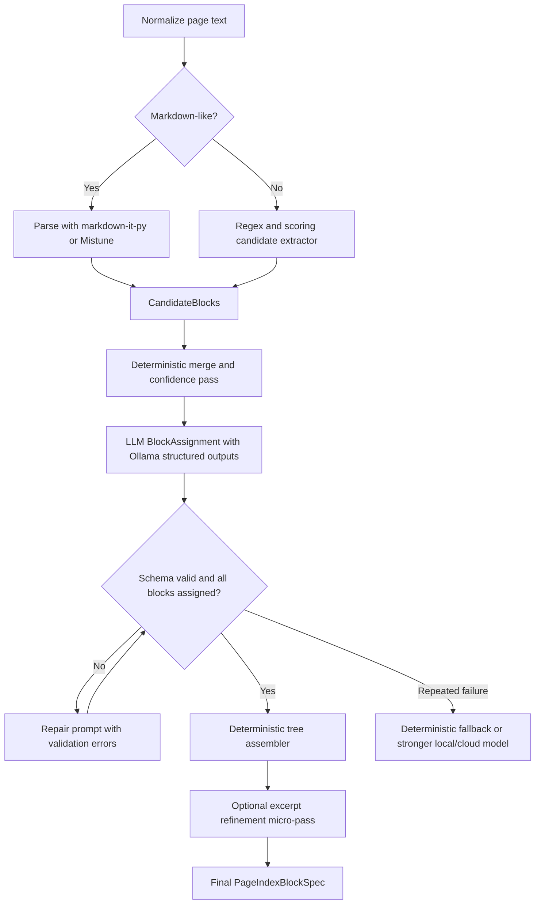

# Robust Page Index Parsing on 8GB Ollama

## Executive summary

For plain-text and markdown-like page parsing on an 8GB laptop, the most robust design is **not** “send the whole page to a local model and ask for a recursive page tree.” The more reliable design is a **hybrid pipeline**: first extract candidate blocks deterministically from the text, then ask a small local model to do only the narrow tasks that heuristics do poorly—primarily **block assignment** (`SECTION`, `SUBSECTION`, `PARAGRAPH`, `TERM`) and, optionally, a tiny **excerpt-refinement** pass. Ollama’s local structured outputs, context controls, Flash Attention, and quantized KV cache make that design practical on constrained hardware, but they do not remove the need to shrink the LLM task. Exact CPU specifications were not provided, so the runtime guidance below is qualitative rather than benchmarked. citeturn38view0turn8view2turn27view0turn27view1turn36view0turn37view0

On this hardware budget, the best first-choice local models for the **block-assignment** step are the **Qwen line**, especially `qwen3:4b-instruct-2507` in `q4_K_M` or `q8_0`, followed by `qwen2.5:7b` in `q4_K_M`. Qwen’s own materials emphasize tool/agent capability for Qwen3 and improved structured output—especially JSON—for Qwen2.5. **Llama 3.1 8B** and **Phi-4-mini** are solid fallback choices. **Gemma 3 4B** is viable but more prompt-sensitive because Google’s Gemma 3 prompt format explicitly does **not** support a separate `system` role, only `user` and `model`. **Gemma 4** fixes that with native system-role and function-calling support, but the current Ollama artifacts for `gemma4:e2b` and especially `gemma4:e4b` are too close to or beyond a practical 8GB ceiling for comfortable local use in this workload. citeturn19view1turn8view8turn17view3turn15view3turn20search0turn22search11turn29view0turn8view6turn16view1turn16view2

For non-LLM structure extraction, the right first move is usually a **real markdown parser**, not an LLM. `markdown-it-py` follows CommonMark and is configurable; Mistune is fast and CommonMark-compatible; Docling and Unstructured are useful when you want normalized semantic elements like `Title`, `NarrativeText`, and `ListItem`; Marker is excellent for PDF/Office-to-Markdown conversion, schema extraction, and LLM-assisted repair, but it is overkill when the source is already plain text or markdown-like text. citeturn35view6turn35view7turn35view0turn35view1turn35view4turn35view5turn35view3

The strongest practical recommendation is therefore:

1. **Parse structure deterministically first**.
2. **Use Ollama structured outputs with a very small flat schema**.
3. **Build the recursive `PageIndexBlockSpec` tree deterministically afterward**.
4. **Escalate to a larger local or cloud model only on validation failure**, not by default. citeturn38view0turn38view2turn8view2turn27view0

## Local model choices for 8GB Ollama

The real hardware constraint on Ollama is not just model parameter count. It is the combination of **model artifact size**, **context length**, and whether the model remains resident or spills into CPU offload. Ollama’s own documentation notes that increasing context length increases memory usage, recommends avoiding CPU offloading when possible, and exposes `ollama ps` so you can inspect whether a model is fully GPU-loaded or partially offloaded. Ollama also documents Flash Attention and quantized KV cache as the primary local levers for reducing runtime memory. citeturn8view2turn27view0turn27view1

In practice, on an 8GB laptop, a good rule is:

- **Comfort zone:** model artifact up to about **5GB**.
- **Borderline zone:** **5–7GB**, only with modest `num_ctx`.
- **Pain zone:** **7GB+**, likely too much headroom loss for a parsing workload unless the rest of the system is extremely lean and the context is kept low.

That rule is a deployment heuristic, not a vendor benchmark, but it follows directly from Ollama’s memory/context guidance and the current artifact sizes in the Ollama model library. citeturn8view2turn27view1turn15view0turn15view3turn14view2turn31view2turn32view0

The table below uses current Ollama artifact sizes as the **practical local memory footprint** and vendor model documentation for capability notes. The final suitability score is my synthesis for **this exact task**—block assignment for page-index parsing on an 8GB Ollama setup—not a benchmark result. citeturn17view3turn33view1turn15view3turn15view5turn31view2turn32view0turn14view4turn14view2turn16view1turn30search1turn19view1turn8view8turn29view0turn8view6turn20search0turn14view7turn22search11

| Name | Size | Local memory footprint | Strengths | Weaknesses | Suitability score for block-assignment |
|---|---:|---:|---|---|---:|
| `qwen3:4b-instruct-2507-q4_K_M` | 4B | 2.5GB | Best default fit; updated instruct tag; strong Qwen tool/agent pedigree | Still only 4B; can miss very deep nesting | 9.1 |
| `qwen3:4b-instruct-2507-q8_0` | 4B | 4.3GB | Best quality/fit balance if it stays resident | Less headroom for KV cache and context | 9.3 |
| `qwen3:8b-q4_K_M` | 8B | 5.2GB | Stronger raw judgment than 4B | Current Ollama tag is older and shows 40K context; not the cleanest fit | 8.4 |
| `qwen2.5:7b-q4_K_M` | 7B | 4.7GB | Officially strong on structured outputs, especially JSON | Older family than Qwen3; 32K tag | 8.9 |
| `phi4-mini:3.8b-q4_K_M` | 3.8B | 2.5GB | Tiny, fast, 128K tag, built-in function calling signal | Weaker hierarchy judgment on dense pages | 8.3 |
| `llama3.1:8b-instruct-q4_K_M` | 8B | 4.9GB | 128K tag; official JSON-based tool calling | Slightly heavier than Qwen 4B/7B alternatives | 8.0 |
| `llama3.2:3b-instruct-q4_K_M` | 3B | 2.0GB | Very lightweight; edge-friendly; tool-use signal | Noticeably weaker at multi-level structure | 7.6 |
| `mistral:7b-instruct-v0.3-q4_K_M` | 7B | 4.4GB | Mature 7B; official function-calling support | Not as JSON-oriented as Qwen2.5 for this task | 7.3 |
| `gemma3:4b-it-q4_K_M` | 4B | 3.3GB | Fits well; 128K tag; laptop-oriented family | Gemma 3 officially lacks system-role support; prompt-template sensitivity | 6.8 |
| `gemma4:e2b-it-q4_K_M` | E2B | 7.2GB | Native system role; function calling; stronger agentic design | Borderline to poor fit on 8GB Ollama | 6.3 |
| `gemma4:e4b-it-q4_K_M` | E4B | 9.6GB | Most capable small Gemma 4 tag | Not realistic on 8GB local | 3.5 |
| `llama2:7b-chat-q4_K_M` | 7B | 4.1GB | Broad compatibility | Only 4K context; older instruction quality | 5.5 |

A few model-family conclusions matter more than the table itself.

**Qwen is the strongest family for this exact job.** Qwen3’s official repo highlights tool use across deployment stacks including Ollama, and Qwen2.5’s official release blog explicitly calls out stronger structured outputs, especially JSON. For a page-index parser that needs schema-constrained outputs more than open-ended reasoning, that is the single most relevant vendor signal among the 4–8B candidates. citeturn19view0turn8view8

**The specific Qwen tag matters.** The current Ollama `qwen3:4b-instruct-2507` tags expose **256K** context in Ollama, while the current `qwen3:8b` tag shown in the Ollama library exposes **40K**. That does not make the 8B model bad, but it does mean the current 4B instruct packaging is cleaner and more up-to-date for this deployment target. citeturn17view3turn15view0turn33view1

**Gemma 3 is not a normal “system prompt” model.** Google’s Gemma 3 prompt-format documentation explicitly says the instruction-tuned Gemma models are designed to work with only `user` and `model` roles, not a separate `system` role. That is a very plausible explanation for why otherwise reasonable page-index prompts can behave strangely on Gemma 3 when routed through generic chat abstractions that rely heavily on system messages. If you must use Gemma 3, move the critical instructions into the first user turn or override the template with a custom Modelfile. citeturn29view0turn37view0turn37view1

**Gemma 4 is architecturally better for structured control, but packaging makes it a poor 8GB choice.** Google’s Gemma 4 docs advertise native system-role support and function calling, which are exactly the features that help with bounded JSON tasks. But the current Ollama `gemma4:e2b-it-q4_K_M` artifact is **7.2GB** and `gemma4:e4b-it-q4_K_M` is **9.6GB**, leaving too little breathing room on an 8GB machine for comfortable parsing once runtime context is included. Interestingly, Google’s own model overview lists lower approximate Q4 inference-memory numbers for E2B and E4B, but on **Ollama**, the artifact sizes are the binding local constraint. citeturn8view5turn8view6turn16view1turn16view2turn16view3

**Llama 3.1 remains a strong fallback because Meta documents JSON-based tool calling.** Llama 3.1’s official prompt-format materials mention JSON-based tool calling, and the current Ollama `8b-instruct-q4_K_M` artifact is still within a workable local envelope at **4.9GB**. Llama 3.2 3B is a better “ultra-cheap” parsing fallback than Llama 2, because Meta/Ollama position it for local rewriting, summarization, and tool use, whereas Llama 2 is limited by its older 4K-context default and age. citeturn20search0turn31view2turn15view7turn32view0turn14view9turn30search1

**Phi-4-mini deserves to be in the short list.** Microsoft’s Phi materials describe Phi-4-mini as having built-in function calling, and the current Ollama artifact is only **2.5GB**. I would not make it the first-choice hierarchy model over Qwen, but it is very attractive as a secondary model for **excerpt refinement** or as the “fast repair” model when the first block-assignment pass fails validation. citeturn22search11turn15view5turn14view6

## Non-LLM structure extraction for plain text and markdown

For markdown-like input, the fastest win is to **trust the syntax before you trust the model**. CommonMark defines ATX headings, Setext headings, and list-item precedence rules. `markdown-it-py` explicitly follows CommonMark and is configurable; Mistune is a fast Python markdown parser compatible with CommonMark-style rules. Those are the right first-pass tools when the source text already looks like markdown. citeturn34view1turn34view2turn35view6turn35view7

If the text is only **quasi-markdown**—for example, numbered clauses, all-caps headings, short title-case lines, or mixed bullets—then you want a **lightweight line/block classifier** instead of a markdown-only parser. In that regime, a homegrown regex-plus-scoring extractor is usually more robust than trying to coerce a small local LLM into discovering the block boundaries from scratch. The CommonMark rules are still useful as a baseline because they define the most stable heading and list cases, especially Setext heading ambiguity and ordered-list precedence. citeturn34view1turn34view2

Docling and Unstructured are useful when you want **semantic normalization** instead of only syntactic parsing. Docling can parse plain text and markdown into a unified document representation and export lossless JSON locally. Unstructured’s partitioning API yields typed elements such as `Title`, `NarrativeText`, and `ListItem`, which maps nicely onto page-index pipelines. Marker is a strong document-conversion tool for PDFs and Office documents, supports JSON/schema extraction, and can optionally use LLMs, but for already-plain text it adds more stack than value. citeturn35view0turn35view1turn35view2turn35view4turn35view5turn35view3

The following table frames the tools the same way as the model table: by **suitability for block-assignment preprocessing** on this specific workload. The memory-footprint column is qualitative because these are software stacks rather than model artifacts. The scores are again synthesis, not benchmarks. citeturn35view6turn35view7turn35view0turn35view4turn35view3turn35view8

| Name | Size | Local memory footprint | Strengths | Weaknesses | Suitability score for block-assignment |
|---|---:|---|---|---|---:|
| `markdown-it-py` | n/a | Very low | CommonMark-aligned, configurable, fast enough for ingestion | Markdown only | 9.5 |
| `Mistune` | n/a | Very low | Fast, simple, plugin-friendly, no external deps | Markdown only | 9.2 |
| Regex + scoring classifier | n/a | Very low | Best for quasi-markdown/plain text; deterministic | Requires engineering and gold tests | 9.0 |
| `Unstructured partition_md/text` | n/a | Moderate | Gives `Title`/`NarrativeText`/`ListItem` elements | Generic; more dependencies | 8.1 |
| `Docling` | n/a | Moderate | Plain text + markdown + multi-format + local JSON | Broader stack than needed for text-only | 7.5 |
| `tree-sitter-markdown` | n/a | Low to moderate | Incremental parsing; GFM-style extensions available | Its own README warns against correctness-critical use | 6.5 |
| `Marker` | n/a | High | Great for PDF/Office → Markdown/JSON; schema extraction | Overkill for text already extracted | 4.5 |

One tool warning is worth stating explicitly: the `tree-sitter-markdown` project says **it is not recommended where correctness is important**. That makes it a useful auxiliary parser for editor-like tasks and syntactic hints, but not a structure oracle for a page-index ingestion pipeline. citeturn35view8

## Hybrid parser design

The core design choice is to make the local model solve a **flat classification problem**, not a recursive-generation problem.

The LLM should **not** emit `child_nodes` directly. Instead:

1. deterministic code extracts **CandidateBlocks**;
2. the local model emits a flat list of **BlockAssignments**;
3. deterministic code validates the assignments and builds the recursive **PageIndexBlockSpec** tree.

That decomposition is the single highest-leverage refactor for small local models.

### Candidate block extraction

For markdown-like text, use `markdown-it-py` or Mistune as the fast path. For everything else, use a candidate extractor built around a small set of high-value patterns aligned to CommonMark where possible. CommonMark is especially useful for ATX headings, Setext headings, and list ambiguity rules. citeturn34view1turn34view2turn35view6turn35view7

A good starting rule set is:

| Pattern / heuristic | Example regex or logic | Emit | Base confidence |
|---|---|---|---:|
| ATX heading | `^[ \t]{0,3}(#{1,6})[ \t]+(.+?)(?:[ \t]+#+)?[ \t]*$` | heading candidate with level from `#` count | 0.95 |
| Setext heading | line `X` followed by `^[ \t]{0,3}(=+|-+)[ \t]*$` | heading candidate level 1 or 2 | 0.93 |
| Numbered heading | `^[ \t]{0,3}(?P<num>\d+(?:\.\d+){0,4}|[IVXLCM]+|[A-Z])(?:[.)])?[ \t]+(?P<title>[A-Z][^\n]{2,120})$` | heading candidate | 0.82 |
| Legal subclause | `^[ \t]{0,3}\((?P<num>\d+|[a-z]|[ivx]+)\)[ \t]+(?P<text>\S.*)$` | subclause / TERM candidate | 0.74 |
| Bullet / ordered list | `^[ \t]{0,6}(?:[-*+•]|[0-9]{1,3}[.)])[ \t]+(?P<text>\S.*)$` | list-item / TERM candidate | 0.72 |
| ALL CAPS short line | length ≤ 80, mostly uppercase tokens, no terminal period | heading candidate | 0.68 |
| Standalone title-case line | surrounded by blank lines, no terminal period, ≤ 12 words | heading candidate | 0.64 |
| Paragraph block | consecutive nonblank lines not matched above | paragraph candidate | 0.80 |

For ambiguous headings, the most useful deterministic features are:

- **promote** if surrounded by blank lines;
- **promote** if followed by a paragraph or list block;
- **promote** if it has numbering (`1`, `1.2`, `A`, `IV`, `(a)`);
- **demote** if it ends with a full stop;
- **demote** if it is long enough to read like a full sentence;
- **demote** if it looks table-like, date-like, or numeric-heavy;
- **demote** if stopword ratio is high and title-case ratio is low.

A workable confidence function is:

```text
score =
  clamp(0, 1,
    base
    + 0.10 * surrounded_by_blank_lines
    + 0.10 * followed_by_nonblank_block
    + 0.10 * has_numbering
    + 0.08 * high_titlecase_ratio
    - 0.12 * ends_with_period
    - 0.10 * looks_like_sentence
    - 0.15 * looks_like_table_row
    - 0.08 * too_many_words
  )
```

Then merge deterministically:

- merge adjacent plain lines into a paragraph until a blank line or a stronger structural candidate appears;
- merge indented continuation lines into the preceding bullet/list item;
- merge heading-like lines with immediately following continuation lines only when the second line is short and also heading-like;
- if two consecutive heading candidates have very low confidence and no body text between them, keep the stronger as heading and demote the weaker to paragraph text unless numbering implies real nesting.

A minimal **CandidateBlock** representation can look like this:

```json
{
  "block_id": "p0001-b006",
  "page_number": 1,
  "order": 6,
  "kind_hint": "heading_numbered",
  "confidence": 0.91,
  "text": "## Finding 2",
  "line_start": 19,
  "line_end": 19,
  "indent": 0
}
```

Use a stable block-id scheme. I recommend:

- `p{page:04d}-b{seq:03d}` for raw candidates;
- subtree IDs only after final assembly, if needed.

### Minimal LLM task

For small local models, the first LLM task should be **BlockAssignment**, not full tree generation.

The schema should be deliberately flat:

```json
{
  "block_id": "p0001-b006",
  "parent_id": "p0001-b001",
  "node_type": "SUBSECTION",
  "title": "Finding 2"
}
```

That is enough to reconstruct the final tree. It keeps the output short, makes validation easy, and avoids asking a 4B model to balance both hierarchy and recursion at once.

A second, optional micro-task can refine excerpts after the tree is assembled:

```json
{
  "block_id": "p0001-b006",
  "excerpt": "Finding 2"
}
```

This separation matters because Ollama’s own structured-output guidance recommends providing a JSON schema in `format`, grounding the model with the schema in the prompt, and lowering temperature for deterministic completions. That advice becomes much easier to follow when the schema is small. citeturn38view2

A strong **system prompt** for small local models is:

```text
You assign structure to pre-extracted blocks from one page.

Return JSON only, matching the BlockAssignment schema.

Rules:
- Use every block_id exactly once.
- node_type must be one of SECTION, SUBSECTION, PARAGRAPH, TERM.
- parent_id must be null or an earlier block_id.
- SECTION or SUBSECTION only for heading-like blocks.
- TERM only for short list items, labels, or clause stubs.
- If uncertain, choose PARAGRAPH.
- Do not invent content.
- Keep title short and derived from the block text.
- Never return child arrays or nested objects.
```

A strong **user prompt** is:

```text
Page number: 1
Source format: markdown-like text

BlockAssignment schema:
{
  "type": "array",
  "items": {
    "type": "object",
    "properties": {
      "block_id": {"type": "string"},
      "parent_id": {"type": ["string", "null"]},
      "node_type": {"type": "string", "enum": ["SECTION", "SUBSECTION", "PARAGRAPH", "TERM"]},
      "title": {"type": "string"}
    },
    "required": ["block_id", "parent_id", "node_type", "title"]
  }
}

Candidates:
1. block_id=p0001-b001 kind=heading_h1 score=0.98 text="Watershed Resilience Brief 001"
2. block_id=p0001-b002 kind=heading_h2 score=0.97 text="Finding 1"
3. block_id=p0001-b003 kind=paragraph score=0.84 text="Inspection notes describe detention basin capacity..."
4. block_id=p0001-b004 kind=heading_h2 score=0.97 text="Finding 2"
5. block_id=p0001-b005 kind=paragraph score=0.85 text="Maintenance actions are staged by priority..."

Return the assignments in input order.
```

For **Gemma 3 specifically**, do **not** rely on a separate system message for the critical rules. Google’s Gemma 3 prompt docs explicitly say that the `system` role is unsupported. If you must run Gemma 3, embed the system rules at the top of the first user turn, or create a custom Modelfile/template that does not depend on a system turn. citeturn29view0turn37view0turn37view1

Token-budget guidance for 8GB local models:

- send **candidate blocks, not the whole page**;
- keep one request to roughly **10–25 blocks**;
- for 4B models, try to stay under about **1,200 prompt tokens**;
- for 7–8B models, **2,000 prompt tokens** is a reasonable starting ceiling;
- set `temperature` to **0** or **0.1**;
- set a fixed `seed`;
- use `num_predict` only large enough to cover the flat JSON array, typically **`18 * block_count + 64`** for `BlockAssignment`;
- use a much smaller `num_predict` for excerpt refinement, often **64–160** total. Ollama exposes these runtime controls directly in Modelfiles and request options. citeturn37view0turn37view1turn37view2turn37view3

The local pipeline should look like this:



A final **PageIndexBlockSpec** can then be built deterministically:

```json
{
  "title": "Page 1",
  "node_type": "SECTION",
  "excerpt": "Watershed Resilience Brief 001",
  "child_nodes": [
    {
      "title": "Finding 1",
      "node_type": "SUBSECTION",
      "excerpt": "Inspection notes describe detention basin capacity...",
      "child_nodes": []
    },
    {
      "title": "Finding 2",
      "node_type": "SUBSECTION",
      "excerpt": "Maintenance actions are staged by priority...",
      "child_nodes": []
    }
  ]
}
```

## Validation, assembly, and fallback

Validation is where a small local pipeline becomes production-safe. Ollama’s structured-output documentation already recommends schema validation with Pydantic or Zod and low temperature. In a page-index parser, that should be extended into a full deterministic validator. citeturn38view2

The minimum validation rules I would enforce are:

| Rule | Why it matters |
|---|---|
| Every `block_id` appears exactly once | Prevents dropped or duplicated source coverage |
| `node_type` is in the enum | Prevents schema drift |
| `parent_id` is null or references an earlier block | Prevents forward references and most cycles |
| No cycles in parent graph | Hard safety requirement |
| Rootless paragraphs attach to page root | Keeps output usable even when heading detection is weak |
| `TERM` blocks are short or explicitly label-like | Prevents accidental paragraph collapse |
| `SECTION` / `SUBSECTION` assignments require heading-like evidence or children | Prevents overpromotion |
| Excerpts must be exact substrings of block text | Keeps grounding strict |
| Output order follows input order | Preserves reading order |
| Depth jumps are repaired deterministically | Avoids malformed hierarchy when the model skips levels |

A deterministic tree assembler can be as simple as:

```python
def assemble_page(page_number: int, page_title: str, blocks, assignments, excerpts):
    by_id = {a["block_id"]: a for a in assignments}
    nodes = {}
    root = {
        "title": f"Page {page_number}",
        "node_type": "SECTION",
        "excerpt": page_title,
        "child_nodes": [],
    }
    nodes[None] = root

    ordered_ids = [b["block_id"] for b in sorted(blocks, key=lambda x: x["order"])]

    # materialize nodes
    for bid in ordered_ids:
        a = by_id[bid]
        nodes[bid] = {
            "title": a["title"],
            "node_type": a["node_type"],
            "excerpt": excerpts.get(bid, blocks_by_id[bid]["text"][:160]),
            "child_nodes": [],
        }

    # attach nodes
    for bid in ordered_ids:
        a = by_id[bid]
        parent_id = a["parent_id"]

        # deterministic repairs
        if parent_id not in nodes:
            parent_id = None
        if parent_id == bid:
            parent_id = None

        parent = nodes[parent_id]

        # optional type repair:
        if a["node_type"] in {"SECTION", "SUBSECTION"} and not looks_heading(blocks_by_id[bid]):
            nodes[bid]["node_type"] = "PARAGRAPH"

        parent["child_nodes"].append(nodes[bid])

    return root
```

The fallback ladder should be explicit.

First, if the JSON is malformed or incomplete, retry with a **repair prompt** that includes:

- the original candidate list,
- the invalid JSON,
- a terse list of validation errors,
- and the instruction “return corrected JSON only.”

Second, if the JSON is well-formed but semantically weak, split the page into **smaller batches**—for example, per major heading candidate or every 10–15 blocks—and rerun the block-assignment stage.

Third, if the page still fails after two local retries, use a deterministic fallback:

- heading candidates become `SECTION` / `SUBSECTION` by confidence band;
- list items become `TERM`;
- everything else becomes `PARAGRAPH`.

Finally, escalate to a stronger local or cloud model only when:

- hierarchy exactness is mission-critical;
- the page has unusually many ambiguous short headings;
- or the parser fails validation repeatedly on the same page family.

The key architectural point is that **escalation is a tail-path**, not the default path.

## Deployment settings for 8GB Ollama

Ollama’s documented runtime levers are exactly the ones that matter here: `num_ctx`, `temperature`, `seed`, `num_predict`, `top_p`, `keep_alive`, Flash Attention, and KV-cache quantization. The guidance below is the most defensible starting profile for a page-index parser on an 8GB laptop. citeturn37view0turn37view1turn37view2turn37view3turn27view0turn27view1turn36view0

Use these environment settings first:

```bash
OLLAMA_FLASH_ATTENTION=1
OLLAMA_KV_CACHE_TYPE=q8_0
OLLAMA_CONTEXT_LENGTH=4096
```

Then inspect residency with:

```bash
ollama ps
```

That combination follows Ollama’s own memory guidance: Flash Attention reduces memory growth with larger contexts, and `q8_0` KV cache uses roughly half the memory of `f16` with minimal quality loss. If the machine is still under pressure, `q4_0` KV cache is the next lever, but Ollama documents a larger precision trade-off there. citeturn27view0turn27view1turn8view2

For the parsing stages, I would start with:

| Stage | Recommended model | Settings | Why |
|---|---|---|---|
| Candidate extraction | none | n/a | Deterministic only |
| Block assignment | `qwen3:4b-instruct-2507-q4_K_M` | `temperature=0`, `num_ctx=4096`, fixed `seed`, bounded `num_predict` | Best fit on 8GB |
| Higher-fidelity assignment | `qwen3:4b-instruct-2507-q8_0` | same, but only if residency is comfortable | Better quality if it fits |
| Local fallback | `qwen2.5:7b-q4_K_M` or `llama3.1:8b-instruct-q4_K_M` | smaller batches | Stronger fallback |
| Excerpt refinement | `phi4-mini:3.8b-q4_K_M` or same Qwen model | tiny outputs only | Cheap, fast second pass |
| Avoid on 8GB default path | `gemma4:e2b`, `gemma4:e4b` | n/a | Too little headroom for the current Ollama artifacts |

The request body itself should usually look like:

```json
{
  "model": "qwen3:4b-instruct-2507-q4_K_M",
  "messages": [...],
  "format": { "...BlockAssignment JSON schema..." },
  "stream": false,
  "keep_alive": "10m",
  "options": {
    "temperature": 0,
    "seed": 42,
    "num_ctx": 4096,
    "num_predict": 320,
    "top_p": 0.9
  }
}
```

A few practical deployment rules matter more than micro-tuning.

Keep **one model loaded at a time**. On an 8GB machine, repeatedly swapping between a “reasoning model,” a “repair model,” and a “summarizer model” destroys latency and increases the chance of CPU thrash. `keep_alive` should be used to keep the current parsing model warm across adjacent pages. Ollama exposes `keep_alive` directly in the request API. citeturn36view0

For this kind of ingestion step, **concurrency should default to 1** unless you know the machine can tolerate more. That is not because the parser is logically single-threaded; it is because the exact CPU and RAM configuration is unspecified, and model swapping or context growth is much harder to control than request throughput.

If you later add **post-parse reasoning**—summarization, retrieval hints, entity extraction—that can often run on a smaller and cheaper model than the core **structure assignment** stage. In other words, spend your local model budget on the hardest part: turning candidate blocks into a valid hierarchy.

## Implementation checklist and test plan

A robust refactor does not need to be large, but it does need to be phased. The following effort estimates assume one developer and are approximate because the exact laptop CPU/RAM/GPU characteristics were not specified.

| Phase | Scope | Estimated effort | Tests | Exit criterion |
|---|---|---:|---|---|
| Foundation | Add `CandidateBlock`, `BlockAssignment`, validator, deterministic assembler | 1–2 days | Schema tests, acyclicity tests, coverage tests | End-to-end tree builds without any LLM |
| Heuristics | Markdown fast path + regex scorer + merge rules | 2–3 days | Golden-page tests for headings, bullets, clauses, all-caps lines | Candidate extraction stable on representative pages |
| Local LLM integration | Ollama structured outputs + first-pass prompt + repair prompt | 1–2 days | Malformed JSON retries, per-model contract tests | Local pass validated on target models |
| Excerpt refinement | Add optional micro-pass for excerpts | 0.5–1 day | Grounding tests: excerpt must be exact substring | Excerpts become short and exact |
| Hardening | Batch splitting, deterministic fallback, escalation hooks | 1–2 days | Repeated-failure tests, long-page tests, no-heading-page tests | No silent parse failure remains |
| Benchmarking | Build comparison harness across chosen local tags | 1–2 days | Golden corpus diff tests, memory/residency checks | Stable model ranking for your corpus |

The test corpus should include at least:

- clean markdown pages with `#`, `##`, and bullet lists;
- quasi-markdown pages with numbered clauses but no heading markers;
- pages with **all-caps lines** that are real headings;
- pages with **all-caps lines** that are just emphasis and should not become headings;
- pages with dense legal subclauses like `(a)`, `(i)`, `1.2.3`;
- pages with no headings at all;
- pages with repeated labels like `Finding 1` through `Finding 7`;
- and adversarial pages containing dates, table-like rows, or numeric identifiers that can confuse heading detection.

The highest-value acceptance tests are not semantic beauty tests. They are:

- **every source block covered exactly once**;
- **no cycles**;
- **stable reading order**;
- **exact excerpt grounding**;
- **no empty child arrays for obviously structured pages unless the page is truly flat**;
- and **no parse accepted when the validator says it failed**.

If you want one concrete starting point, start with:

- `markdown-it-py` fast path,
- regex/scoring fallback,
- `qwen3:4b-instruct-2507-q4_K_M` for `BlockAssignment`,
- Ollama structured outputs with a flat schema,
- `temperature=0`,
- `num_ctx=4096`,
- `OLLAMA_FLASH_ATTENTION=1`,
- `OLLAMA_KV_CACHE_TYPE=q8_0`,
- and deterministic assembly of `PageIndexBlockSpec` after validation. That combination is the best balance of robustness, simplicity, and deployability I found for the stated hardware and source format. citeturn35view6turn17view3turn38view2turn27view0turn27view1turn8view2