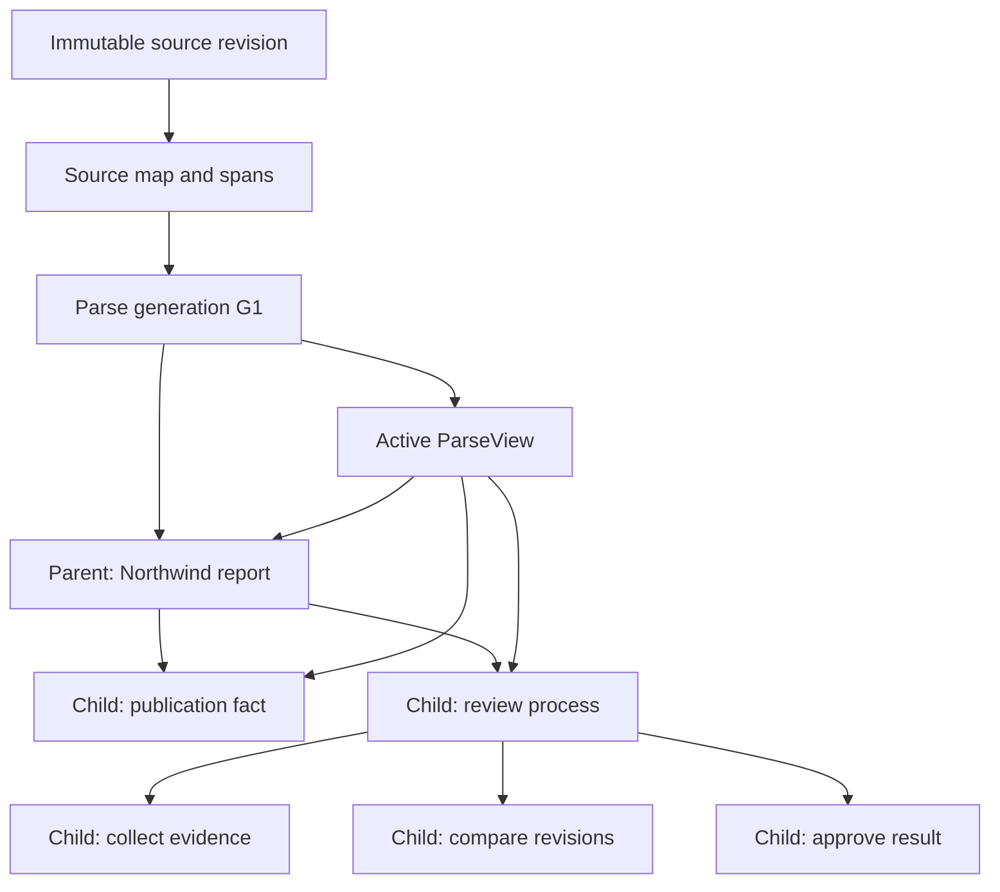
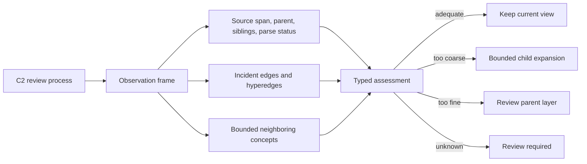
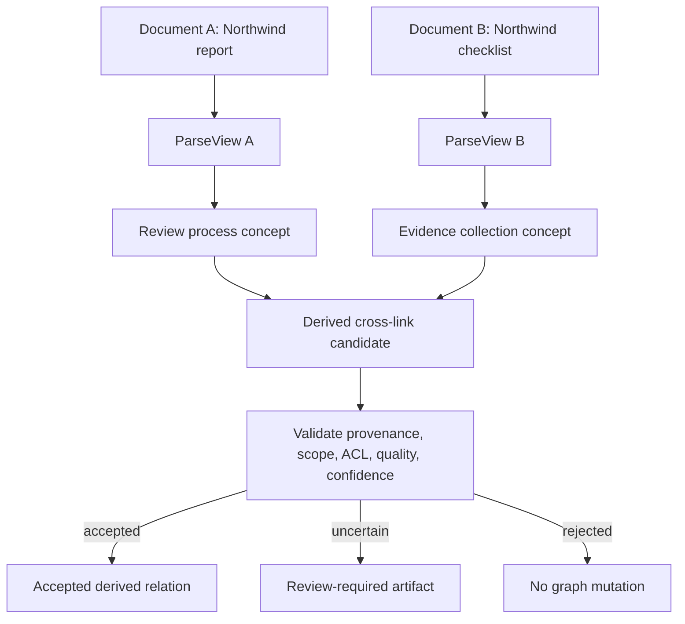
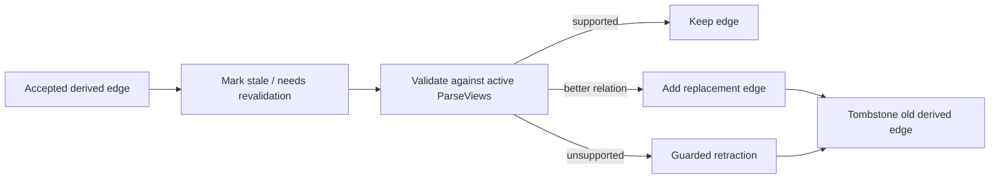

# Tutorial: Bounded Parsing And Cross-Document Maintenance

This tutorial shows how one ordinary document moves through parsing and how a
second document can later produce a guarded cross-document link. Maintenance
observes and proposes improvements; it never rewrites raw source evidence.

## 1. One Document

Example source:

```text
The Northwind report was published in 2026. The report describes a three-step
review process: collect evidence, compare revisions, and approve the result.
```

The source is stored as an immutable source revision and source map. The parser
creates a bounded hierarchy of derived members:



The active ParseView selects the current non-overlapping interpretation. Older
generations remain historical evidence and are not selected for normal
maintenance.

### Maintenance observation

When a worker encounters `C2`, it builds a bounded observation frame:



For example, if the three review steps were incorrectly merged into one
paragraph, the assessment may recommend `expand_children`. The repair creates
an inactive generation, compares its grounding and coverage with the active
view, and activates it only through the per-source ParseView CAS pointer if it
is demonstrably better.

If the parser critic fails, the result is `quality_unknown`; it is not treated
as an adequate parse and cannot produce an accepted cross-link.

## 2. Two Documents And A Cross-Document Concept

Add a second immutable source revision:

```text
The Northwind checklist requires evidence collection before revision comparison.
```

The second document gets its own parse generation and ParseView. The two source
revisions remain independent:



The candidate must carry evidence from both documents, for example:

```json
{
  "left_node_id": "ws:demo:doc-a:review-process",
  "right_node_id": "ws:demo:doc-b:evidence-collection",
  "relation": "related_to",
  "left_source_document_id": "doc-a-revision-1",
  "right_source_document_id": "doc-b-revision-1",
  "confidence": 0.72,
  "source_pointers": [
    {"doc_id": "doc-a-revision-1", "start_char": 86, "end_char": 145},
    {"doc_id": "doc-b-revision-1", "start_char": 26, "end_char": 48}
  ]
}
```

The proposal creates a derived edge with `crosslink_status="candidate"`. It
does not make similarity into canonical truth. A later validation action must
raise confidence to the acceptance threshold and preserve both evidence sides
before the existing guarded patch-apply path can add the accepted edge.

If either source receives a new active ParseView, the worker does not rewrite
the accepted edge. It queues `document_revalidate_crosslinks` for only the
affected derived edges and records `needs_revalidation`. A replacement keeps
the old edge until validation succeeds, then atomically adds the replacement
and tombstones the old derived edge. Source-native edges are rejected by this
path.

## 3. Updating And Removing A Link

If Document B receives a new revision and the relation is no longer supported:



Replacement is append-plus-tombstone, never an in-place update. Source-native
edges and raw source facts are not eligible for cross-link retraction.

## 4. Running The Example

The exact transport used to submit maintenance depends on the deployment, but
the durable job payload has this shape:

```json
{
  "maintenance_kind": "review_maintenance_subject",
  "workspace_id": "demo",
  "subject_kind": "node",
  "subject_id": "ws:demo:doc-a:review-process",
  "source_revision_id": "doc-a-revision-1",
  "observation_token_budget": 4000,
  "maintenance_context": {"turns": []}
}
```

The resulting assessment is read-only. It may recommend a bounded parse repair
or cross-link proposal, but each recommendation becomes a separate durable job
with the original request's budgets, round counters, provenance, workspace,
namespace, and authorization context.

## 5. Invariants To Watch

- Raw source revisions and source-map evidence are immutable.
- Only active ParseView selections are eligible for ordinary maintenance.
- Cross-document candidates require evidence from both source documents.
- Workspace, namespace, ACL, source-revision, and embedding-profile checks occur
  before ranking or prompting.
- Similarity alone never creates accepted semantic truth.
- Parse uncertainty blocks accepted cross-links.
- Maintenance continuations do not recursively create user-facing maintenance
  requests or maintenance threads.
- Duplicate delivery is idempotent; ParseView activation remains CAS-protected.
