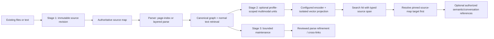

# Tutorial: Grow From Source-Map RAG To Maintained Graph Knowledge

This tutorial shows the supported path from ordinary document retrieval to
parser-grounded graph knowledge, and then to the optional multimodal embedding
projection. It is designed to let a small installation start simply and add
capabilities without replacing its source-of-truth layer.

## Does The Operation Layer Use `kg-doc-parser`?

Yes. This is a real dependency in the current LLM-Wiki operation path, not just
a library that happens to be installed:

| Operation | Existing implementation |
|---|---|
| Default document parsing | `IngestPipeline` defaults to `kg_doc_parser.workflow_ingest.page_index.parse_page_index_document`. |
| Layered parsing | LLM-Wiki's durable parsing workflow calls parser-owned layerwise callbacks and parser contracts. |
| Source grounding | Parser source-map helpers provide authoritative source references. |
| Graph conversion | LLM-Wiki calls `semantic_tree_to_kge_payload` from the parser when persisting parser results. |
| Durable retries, selection, and maintenance policy | Owned by LLM-Wiki, using Kogwistar graph/runtime primitives where applicable; not application state inside `kg-doc-parser`. |

The parser supplies parsing capability and serializable bounded expansion
contracts. LLM-Wiki owns source revisions, workflow persistence, graph writes,
readiness, ACL/workspace policy, and when maintenance runs. The parser does not
automatically index production vectors or migrate an arbitrary old vector
database.

## Migration Path



Canonical source bytes/revisions remain authoritative. Parsed graph content,
maintenance proposals, and vector indexes are derived layers. A vector score is
retrieval evidence, not permission to assert a semantic edge. Workspace scope
and ACL checks still apply when resolving graph references.

| Stage | What you get | Support today |
|---|---|---|
| 1. Source-map RAG | Immutable source revision, parser grounding, canonical graph, ordinary text search/query | Supported through LLM-Wiki `ingest`, `search`, `query`, and `source`. |
| 2. Anchored multimodal projection | Profile-isolated vector rows grouped by source view, typed span, and optional embedding-reference targets | Supported as configured in-process pipeline APIs; requires a projection store, compatible encoder, asset resolver for binary assets, and app-level reference resolution. It is not currently a universal MCP migration command. |
| 3. Maintenance | Bounded background parse refinement, review, and cross-link work over selected source documents | Supported through durable maintenance jobs and worker configuration. |
| Legacy vector-store migration | Reuse old vectors in an anchored index | No generic automatic migration exists. Reuse only when the exact model/profile, source revision, digest, and recoverable locator are known; otherwise retain the old index and re-embed from authoritative sources. |

## Stage 1: Ingest And Search A Plain-Text Source

Start with one text or Markdown document. Give it a stable URI and workspace;
do not hand-create graph nodes or bypass the ingestion operation. This example
uses the local REST tool bridge. Set `LLM_WIKI_AGENT_URL` to your bridge URL;
with the default local setup it may be `http://127.0.0.1:8765`. If request
authentication is enabled, set `LLM_WIKI_AGENT_TOKEN` in the shell rather than
putting a token in the script.

Save as `progressive_rag_demo.py`:

```python
import json
import os
from urllib.request import Request, urlopen


BASE_URL = os.getenv("LLM_WIKI_AGENT_URL", "http://127.0.0.1:8765").rstrip("/")
WORKSPACE = "progressive-rag-demo"


def call_tool(name: str, arguments: dict[str, object]) -> dict[str, object]:
    headers = {"Content-Type": "application/json"}
    token = os.getenv("LLM_WIKI_AGENT_TOKEN")
    if token:
        headers["Authorization"] = f"Bearer {token}"
    request = Request(
        f"{BASE_URL}/mcp/tools/call",
        data=json.dumps({"name": name, "arguments": arguments}).encode("utf-8"),
        headers=headers,
        method="POST",
    )
    with urlopen(request, timeout=120) as response:
        payload = json.loads(response.read())
    # The bridge may wrap the operation value in structuredContent.
    result = payload.get("structuredContent", payload)
    if not isinstance(result, dict):
        raise RuntimeError(f"unexpected {name} response: {payload!r}")
    return result


text = """GPU supply-chain notes

NVIDIA designs GPUs and operates a broad CUDA software ecosystem. AMD competes
with Instinct accelerators and ROCm. When comparing vendors, separate confirmed
facts from estimates and attach each claim to a dated source.
"""

ingest = call_tool(
    "ingest",
    {
        "workspace_id": WORKSPACE,
        "source_uri": "https://example.invalid/tutorial/gpu-supply-chain.md",
        "title": "GPU supply-chain notes",
        "raw_text": text,
        "source_format": "markdown",
        "operation_mode": "parse_first",
        "parser_mode": "heuristic",
        "parser_lane": "page_index",
        "promotion_mode": "pending",
    },
)
print("ingest:", json.dumps(ingest, indent=2))

source_id = str(ingest["artifacts"]["source_document_id"])
source = call_tool(
    "source",
    {"workspace_id": WORKSPACE, "source_document_id": source_id},
)
assert source.get("exists") is True
revision = source.get("revision") or {}
revision_metadata = revision.get("metadata") or {}
source_revision_id = str(revision_metadata["source_revision_id"])
print("source id:", source_id)
print("source revision:", source_revision_id)
print("parse status:", json.dumps(source.get("parse_status"), indent=2))

results = call_tool(
    "search",
    {"workspace_id": WORKSPACE, "query_text": "Which accelerator ecosystems are compared?"},
)
print("search:", json.dumps(results, indent=2))

answer = call_tool(
    "query",
    {"workspace_id": WORKSPACE, "query_text": "Compare NVIDIA CUDA and AMD ROCm based only on this note."},
)
print("grounded answer:", json.dumps(answer, indent=2))
```

Run it after the workbench and agent bridge are available:

```powershell
python .\progressive_rag_demo.py
```

`ingest` returns an `artifacts.source_document_id`; `source` then reports the
revision and parse/readiness state. Preserve that ID for later targeted
maintenance. Re-running with a changed source is a source revision operation,
not an in-place mutation of the old evidence.

### Choose A Parsing/Construction Mode

Use the default `parse_first` mode when initial parser output is useful. The
other supported modes change product orchestration, not the parser's ownership
of its contracts:

```python
# Parse first, then normal follow-up maintenance (default).
parse_first = {"operation_mode": "parse_first"}

# Seed the source map and let durable maintenance phases build/refine structure.
maintenance_first = {"operation_mode": "maintenance_first"}

# Keep a lightweight initial parse and allow durable expansion where supported.
hybrid = {"operation_mode": "hybrid"}
```

`maintenance_first` is appropriate when the first full parse is too expensive
or unreliable. It does not mean the raw source is repeatedly rewritten: the
source revision stays fixed, while parsing and graph derivations may advance.
See the [iterative maintenance ADR](adr_iterative_maintenance_graph_construction.md)
for phases and readiness fences.

## Stage 2: Add Anchored Multimodal Retrieval

Do this only after a source revision is registered. The currently implemented
Python surface is on `IngestPipeline`:

1. `capture_multimodal_source(...)` or `capture_multimodal_units(...)` stores
   revision-bound retrieval views in Stage 1 of the projection.
2. `embed_multimodal_pending(...)` embeds those views into the configured
   profile-scoped projection.
3. `search_multimodal(...)` returns projection hits with source/revision and
   locator information.

Minimal in-process usage (the pipeline must be composed with a multimodal
projection store and encoder first):

```python
# `pipeline` is the application's configured IngestPipeline. Do not create a
# second, unscoped vector store beside the application's profile-scoped store.
bundle = pipeline.capture_multimodal_source(
    workspace_id="progressive-rag-demo",
    source_id=source_id,
    source_revision_id=source_revision_id,  # resolve from `source` response
    source_format="markdown",
    raw_text=text,
    max_chars=1200,
)
embedded_count = pipeline.embed_multimodal_pending(batch_size=16)
hits = pipeline.search_multimodal("GPU accelerator software ecosystem", limit=5)
```

For an image region, construct a revision-pinned source unit with a normalized
bounding box. `MultimodalSourceUnit` is the current app-facing ingestion model;
`to_multimodal_span()` converts recognized locator shapes to Kogwistar's typed
core span:

```python
from kogwistar_llm_wiki.embeddings.multimodal_projection import MultimodalSourceUnit

unit = MultimodalSourceUnit(
    view_id="source-image-region-001",
    workspace_id=WORKSPACE,
    source_id=source_id,
    source_revision_id=source_revision_id,
    modality="image",
    locator={
        "kind": "image_region",
        "x": 0.05,
        "y": 0.08,
        "width": 0.30,
        "height": 0.25,
        "coordinate_system": "normalized_0_1",
    },
    content_ref="object://media/image-17/page-1.png",
    metadata={"description": "upper-left diagram region"},
)
pipeline.capture_multimodal_units([unit])
pipeline.embed_multimodal_pending(batch_size=1, resolver=asset_resolver)
```

The asset resolver must retrieve the referenced bytes from the deployment's
authorized media store. Do not pass arbitrary user-controlled paths to it.
Other source helpers include text splitting, audio intervals, video intervals,
and video tracks with an immutable external frame manifest. See
`src/kogwistar_llm_wiki/embeddings/multimodal_sources.py` for exact signatures.

The core contracts are already present: `MultimodalSpan`, `PinnedLogicalRef`,
and `EmbeddingReference`. An embedding reference requires a pinned authoritative
source-map target; optional semantic or conversation targets are only added
when the application can resolve and authorize them. The dereferencer resolves
the source-map target first and checks authorization for optional targets.
However, a general API endpoint that automatically takes any search hit and
constructs/resolves every graph target is not currently exposed. The service
composition must provide the correct source-map identity, profile fingerprint,
revision pin, and ACL-aware resolver. Until then, treat a multimodal search hit
as grounded projection evidence and resolve its source through the normal
source API; do not invent semantic links from similarity alone.

Each distinct model/preprocessing profile is an isolated projection space even
when dimensions match. ColQwen late-interaction vectors remain grouped under
one source view/embedding set; do not create one graph node per patch vector.

## Stage 3: Queue Bounded Maintenance

After you have a source ID, direct maintenance to that exact document instead
of asking the worker to scan a topic across the workspace:

```python
job = call_tool(
    "maintain",
    {
        "workspace_id": WORKSPACE,
        "source_document_ids": [source_id],
        "maintenance_kind": "document_propose_crosslinks",
        "objective": (
            "Review the parsed concepts against their source spans. Propose only "
            "well-grounded links; do not infer facts from similarity alone."
        ),
        "max_rounds": 1,
        "max_llm_calls": 2,
        "max_tokens": 8000,
        "max_steps": 4,
        "max_time_seconds": 180,
    },
)
print("queued maintenance:", json.dumps(job, indent=2))

status = call_tool("status", {"workspace_id": WORKSPACE})
print("maintenance status:", json.dumps(status.get("maintenance"), indent=2))

source_after = call_tool(
    "source",
    {"workspace_id": WORKSPACE, "source_document_id": source_id},
)
print("updated parse/readiness:", json.dumps(source_after.get("parse_status"), indent=2))
```

`maintain` creates durable jobs; it does not synchronously wait for completion.
Keep the returned `job_ids`, inspect workspace `status`, and inspect the source
again for readiness/generation state. A job only progresses if the maintenance
daemon is running and has a configured provider. Budgets cap work; they do not
guarantee the model will produce a useful proposal. Mutations still go through
the typed patch/review acceptance path.

## What Can And Cannot Be Migrated

| Existing state | Recommended action |
|---|---|
| Original files or source text still available | Register/verify the source revision, then parse and build views from those bytes. This is the preferred path. |
| Existing LLM-Wiki source and graph with source IDs/spans | Keep it. Add a new multimodal projection bound to the exact active source revision; old graph identity does not need to change. |
| Existing vector rows with exact model profile, source revision, content digest, and usable locator | A project-specific adapter can validate and re-index them into the matching isolated projection. Verify every row before activation. |
| Vector rows with unknown model/preprocessing or no source revision/locator | Do not claim they are anchored. Keep them in their legacy retrieval path or re-embed from source. |
| Existing semantic graph nodes with incomplete grounding | Do not silently retrofit fabricated spans. Reparse or mark for review with authentic source evidence. |

There is currently no generic `migrate-rag-to-anchor` command. The safe
incremental rollout is dual-read/parallel-build: preserve the old index, add
the new source-grounded projection for selected sources, compare retrieval
quality, then switch consumers only after profile, grounding, and ACL checks
pass. This avoids a destructive all-at-once migration.

## References

- [Agent gateway quickstart](agent_gateway_quickstart.md)
- [Iterative maintenance graph construction ADR](adr_iterative_maintenance_graph_construction.md)
- [Multimodal evidence reference graph ADR](adr_multimodal_evidence_reference_graph.md)
- [Native multimodal embedding ADR](adr_native_multimodal_embedding_support.md)
- Parser-owned interfaces: `kg-doc-parser/kg_doc_parser/workflow_ingest/__init__.py`
- App parser integration: `src/kogwistar_llm_wiki/ingest_pipeline.py`,
  `src/kogwistar_llm_wiki/parsing/layered_workflow.py`, and
  `src/kogwistar_llm_wiki/ingest/graph_persistence.py`
