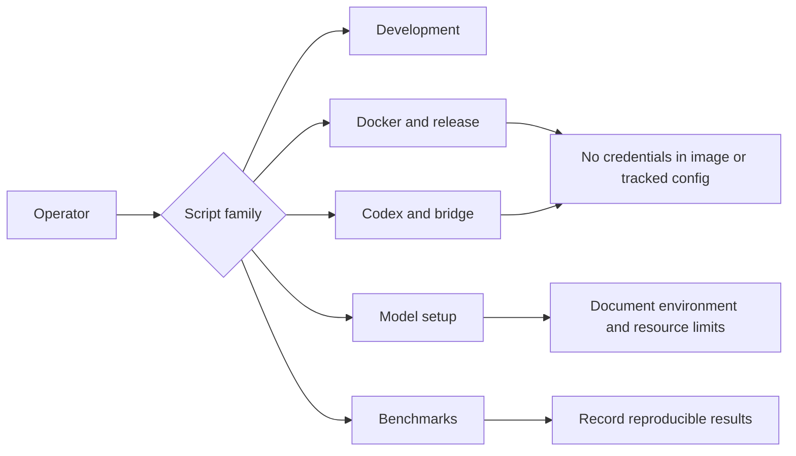

# Operational Scripts

Scripts are grouped by the operation they perform. Use the existing script
names as stable entrypoints; future additions should use these families:

| Family | Examples |
| --- | --- |
| Docker and release | `publish_*`, Docker smoke/build helpers |
| Codex | `start_codex_*`, CA setup, bridge service setup |
| Development | bootstrap and local installation helpers |
| Models | Hugging Face model pullers |
| Benchmarks | multimodal and conversation benchmarks |

Scripts must not write credentials into images, Compose files, or tracked
configuration. Document required environment variables and whether a command
is safe for CI, slow, or manual.
